# Chart gallery

Every figure the platform produces, rebuilt from the current source with one
command:

```bash
meridian charts gallery --out docs/images
```

The valuation date is fixed at 2026-09-18 and the reference instruments are defined
in [`meridian.gallery`](../src/meridian/gallery.py), so these images are
reproducible and cannot drift from the code that draws them. The market data figures
are drawn from the seeded demonstration market in `meridian.services`, planted faults
and all.

---
### Calendars

**Exchange trading calendars** - A year of NYSE, London and TARGET, and the days on which they disagree.


**Where the markets disagree** - Pairwise count of weekdays when one market trades and another is shut.

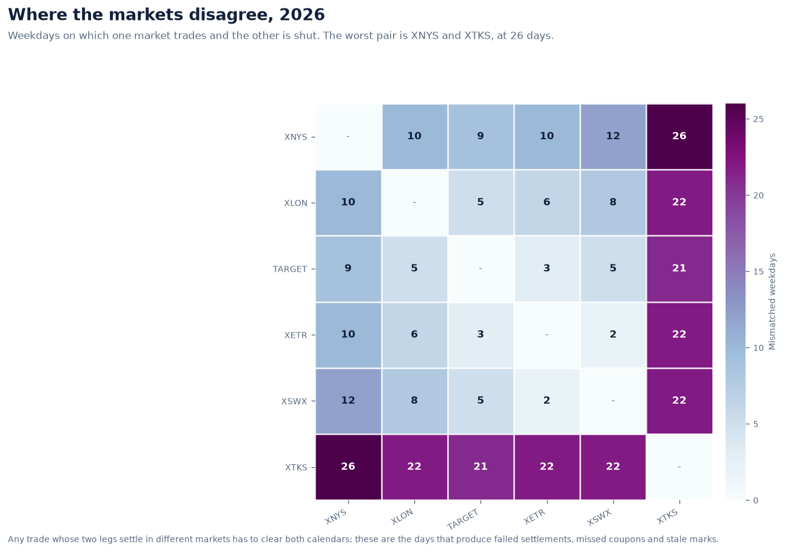

**Settlement ladder** - Where T+0 to T+3 land in each market, and in the joint settlement calendar.


### Rates

**Yield curve, three ways** - Zero, par and forward curves from one set of quoted par yields.


**Interpolation is a modelling choice** - Three methods that agree at the pillars and disagree everywhere else.


**Curve scenarios** - Parallel shifts and key-rate twists applied to the pillars.

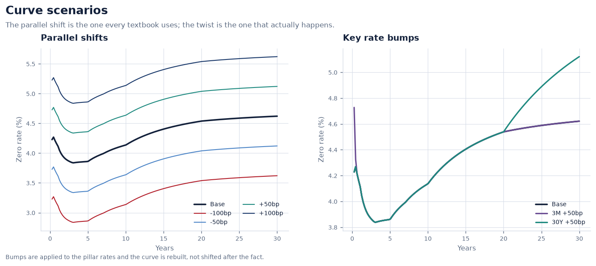

**Duration is a straight line** - The price-yield curve against its first- and second-order approximations.


**Key rate durations** - Where on the curve a bond's interest rate risk actually sits.

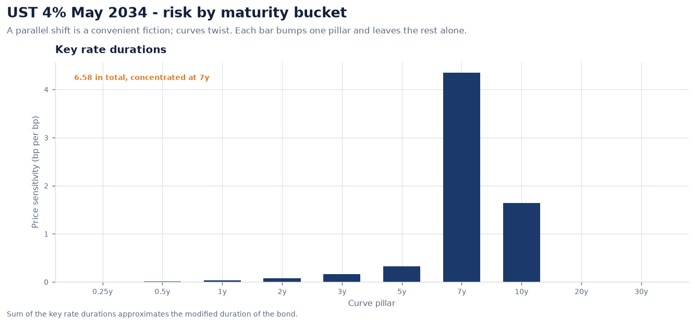

**Compounding conventions** - The same quoted rate, four conventions, materially different money.

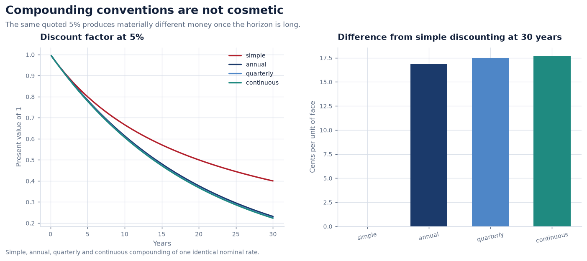

### Cashflows

**Payment schedule** - Accrual periods, the stub, and the payments moved by the business-day rule.

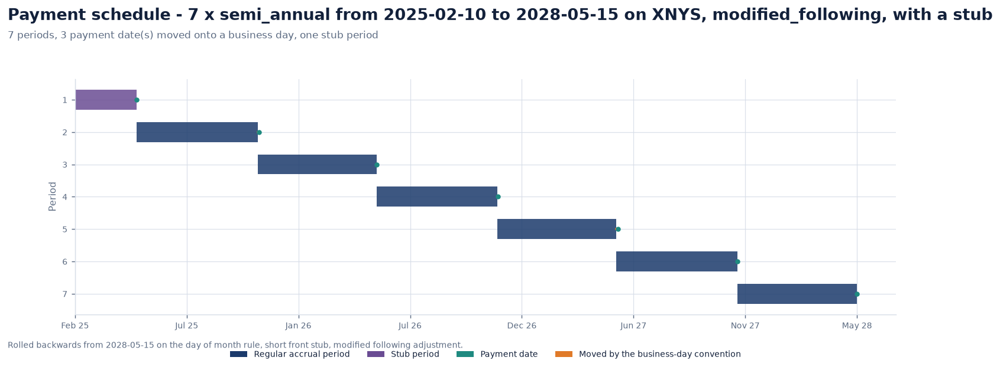

**Cash flows and their present value** - What the bond pays, and what each payment is worth on the curve today.

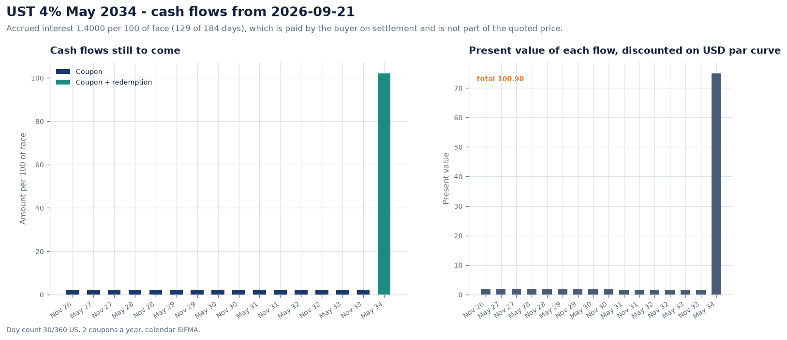

**Accrued interest** - The sawtooth the buyer pays the seller, resetting at every coupon.

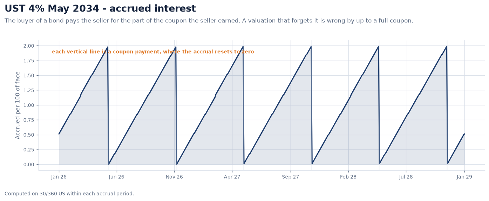

**Where a bond's value comes from** - Coupons against the return of principal, discounted on the curve.

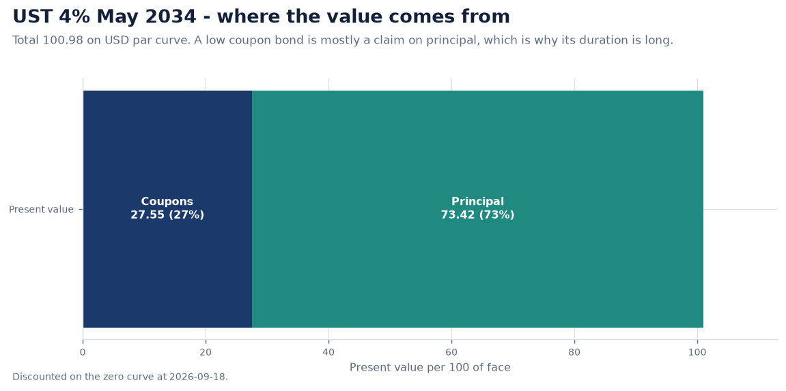

### Money

**Allocating an amount** - A conserving split against naive rounding, and the cash the naive one loses.

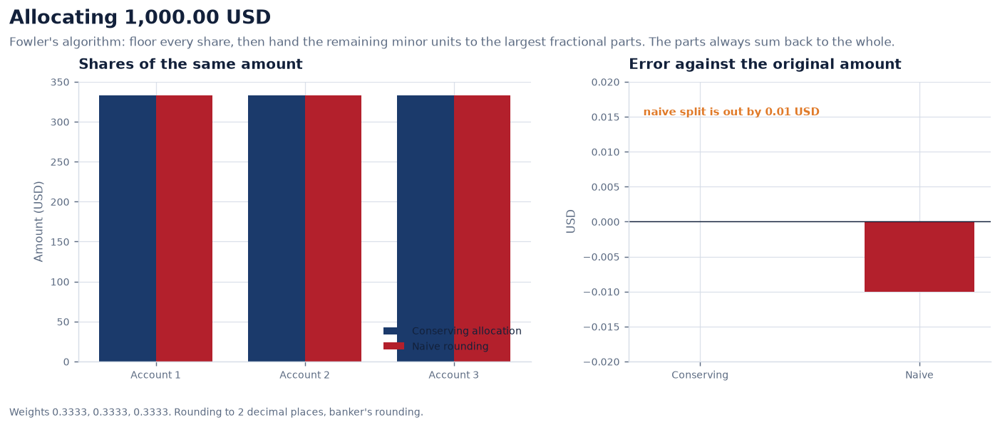

**Rounding error accumulates** - The same split repeated: one method stays on zero, the other walks away.

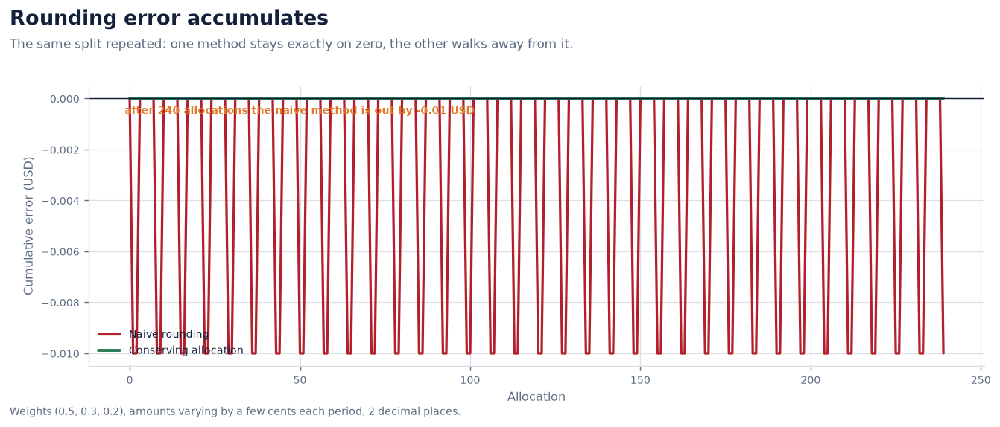

**Day-count conventions** - Year fractions and accrued interest for one period under every convention.

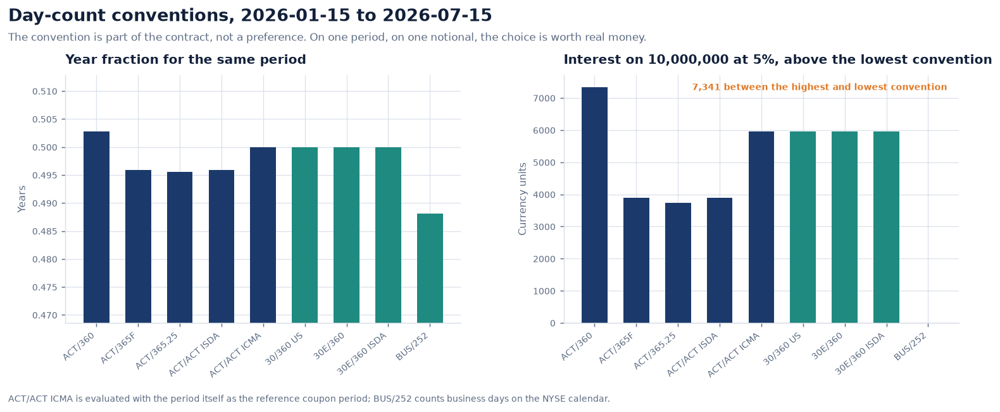

### Quality

**Market data quality dashboard** - Scores by series and dimension, findings by rule, and where in time the problems sit.

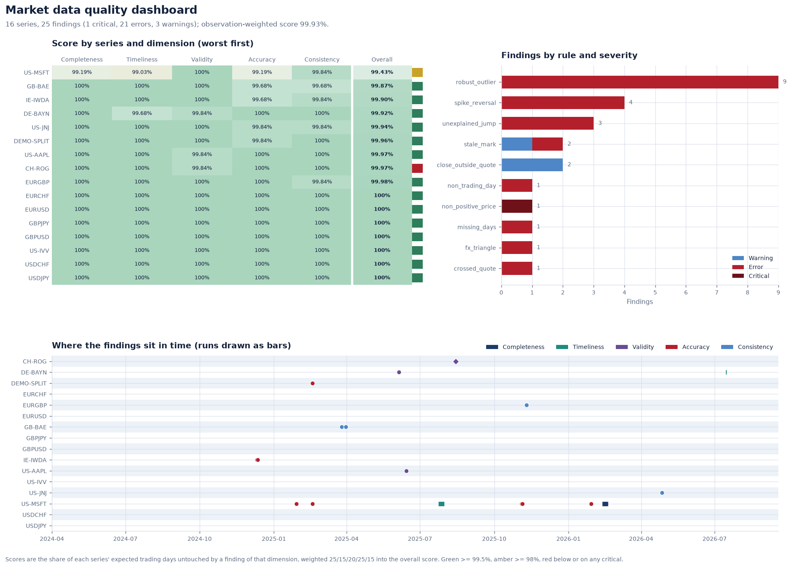

**Finding the bad prints** - One exchange feed with a stale run, a bad tick and a gap, and the robust score that caught them.

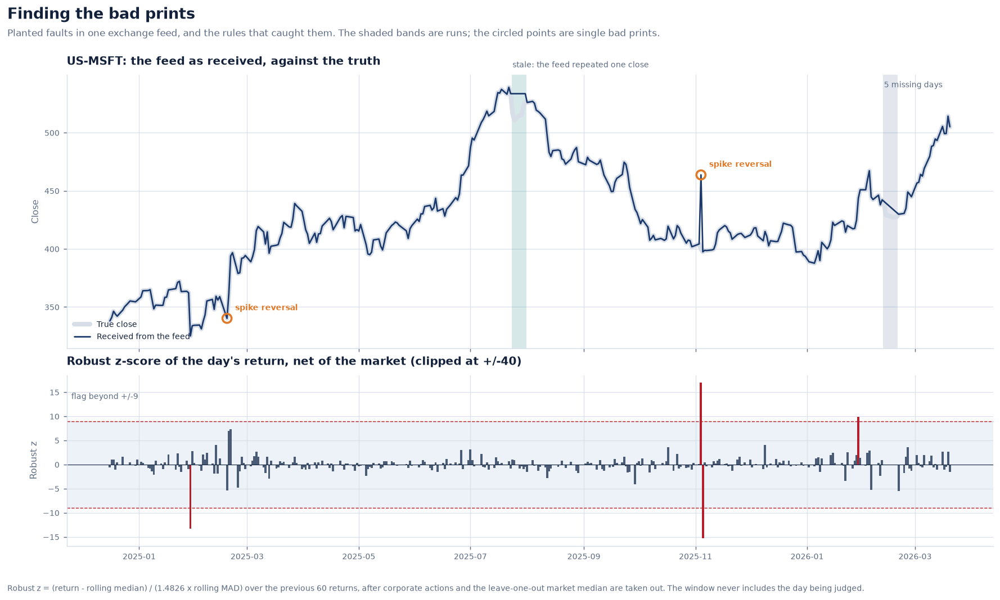

**Why the median, not the mean** - Three bad ticks in one window defeat the classical z-score and not the robust one.


**Measured, not asserted** - Recall by fault type and precision by rule, against faults planted in three seeded markets.


**Expected against received** - Every weekday for every instrument, judged on that instrument's own exchange calendar.

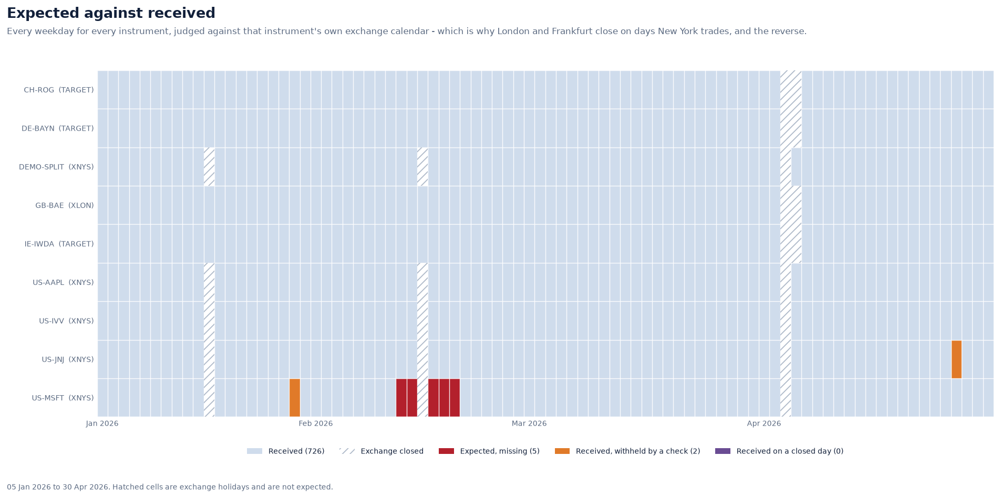

### Market Data

**A split is not a crash** - Raw, capital-adjusted and total-return histories against the generator's economic truth.


**Corporate actions on tax lots** - A split, a spin-off and a dividend applied to a three-lot holding, with basis conserved.


**What we knew, and when** - First prints against restated values: the look-ahead a backtest on restated data enjoys.


**Three vendors, one price** - Each vendor against the golden copy, and every source's error against the truth.


**The triangle must close** - Cross rates against the rates implied by their USD legs, and the cross matrix on one day.

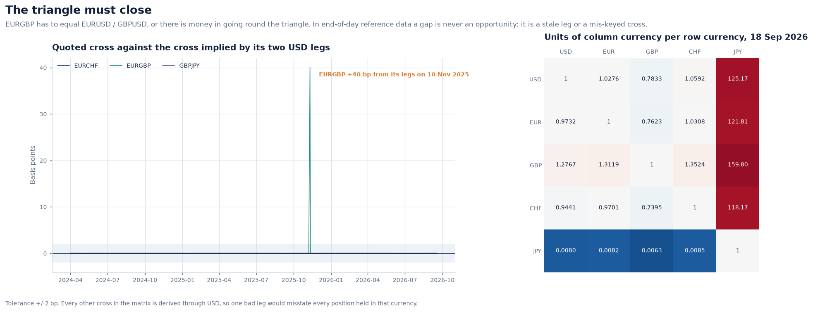

**The synthetic market behaves like a real one** - Fat tails and volatility clustering: the stylised facts every quality rule has to survive.

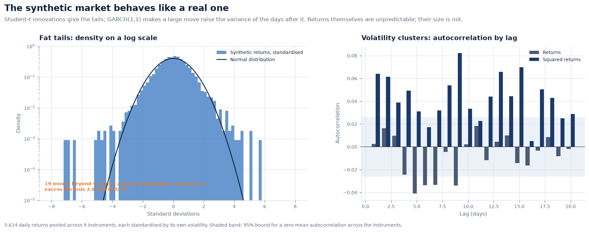

### Reference Data

**An identifier is not a name** - Ticker renames, a reused ticker and an ISIN change, resolved by date.


**One security, three vendors** - Golden records built field by field, with lineage, conflicts and refused values.

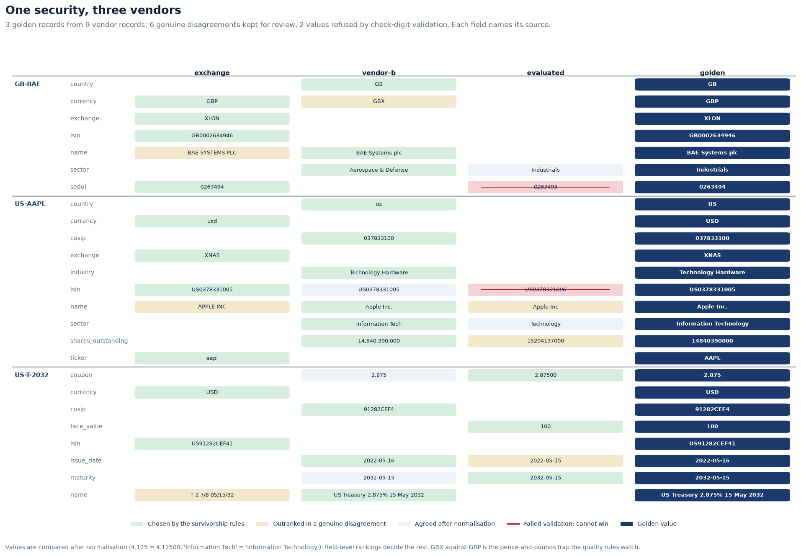

### Platform

**The data model** - Every table, column and foreign key, drawn from the live SQLAlchemy metadata.


