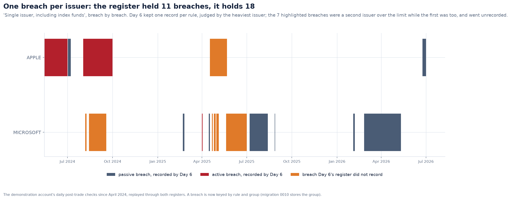
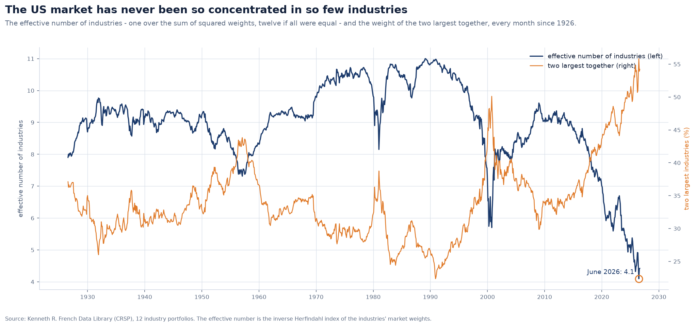
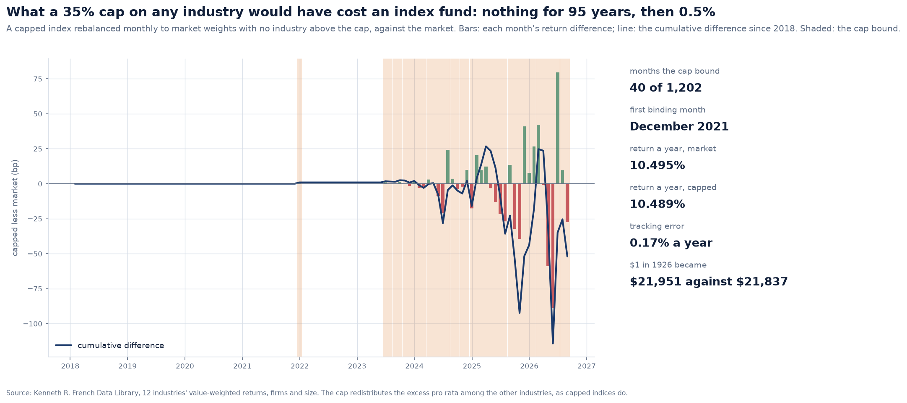
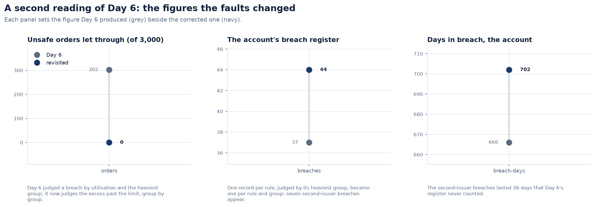

# Compliance that cannot be talked past, and a century of a sector limit

Day 6 made the mandate machine-checkable: a grammar, a rule engine, pre-trade and
post-trade checks and a breach register. Its tests were hand-written cases: this
portfolio, this order, this decision. This revisit asks a different question: what must
the checker guarantee for *every* portfolio and *every* order? It also runs the rules on
a century of the real US market.

---

## 1. What the pre-trade check must guarantee

A pre-trade check has one job above all others: an order it lets through must not make
a hard limit worse. `tests/compliance/test_pretrade_properties.py` lets Hypothesis
write the portfolios and the orders. An oracle in the test, written independently of
the engine, measures how far past each hard limit **every group** is: each issuer, each
sector, the excluded industry, the cash band. The property is simple:

- an order judged "allowed" or "warning" makes no group's excess grow;
- an order judged "blocked" makes some group's excess grow.

Hypothesis broke the first property at once and shrank it to a two-line portfolio. On
3,000 random portfolios and orders, Day 6's rule let **302** unsafe orders through.
The revisited rule lets **none** through. The property runs on 400 new cases every build, and passed a deeper search of 3,000.

There were two faults, and both came from judging a breach by **utilisation**: the
value over the limit, or the limit over the value for a floor.

- **A limit of zero, or a value of zero, makes utilisation infinite.** Under "no
  holdings where industry = Tobacco", an account already holding some tobacco
  measures infinity before and after buying more, so the bigger breach looked
  "unchanged" and the order was allowed. The same happened to cash: against a 1%
  floor, cash of zero is infinite utilisation, and spending more cash looked
  unchanged. Breaches are now measured by their **excess past the limit, in the
  measure's own units** (`engine.excess`), which has no blind spot.
- **"max weight by issuer" was judged by its heaviest issuer alone.** With one issuer
  already over 10%, an order that took a *second* issuer over 10% left the rule's value
  (the heaviest issuer) unchanged, and was allowed. Every group is now judged on its
  own (`engine.group_breaches`). A breach in a group that was within its limit is new,
  whatever the rule's other groups are doing.

Each fault also has a plain regression test that fails on Day 6's code.

## 2. One breach per issuer

The breach register had the second fault in another form. It kept one record per rule,
judged active or passive by the heaviest group, so two issuers over a single-issuer limit
were one breach. It now keys a breach by **rule and group**, judges each on its own
trades, and closes each when that group is back within the limit. Migration 0010 stores
the group.

Replayed, the demonstration account's register holds **44 breaches, not 37**. The seven
it missed are all in the look-through issuer limit: Apple over 16% while Microsoft was
too, for 36 breach-days in all. Active breaches stay at nine; the new ones were all the
market's doing.

## 3. The UCITS screen, as the Directive writes it

The UCITS what-if (`ucits_screen.mandate`) is version 2:

- **The government limit is article 52(3).** Version 1 cited 52(4), which is the
  covered-bond limit.
- **Article 52 covers all transferable securities of one body**, bonds as well as
  shares. Version 1 applied the 10% and 5/10/40 rules to shares only.
- **State issues do not count towards the 40%** (article 52(5)).

A new attribute, `issuer_type` (government, corporate, fund, cash), lets the rules say
this. The account holds no corporate bonds, so its answers are unchanged: Microsoft at
10.3%, and the issuers above 5% together at 53.5%.

## 4. A century of a sector limit

The same engine and register run on Kenneth French's twelve industries every month
since July 1926. The market is held as an index fund would hold it, under:

    rule sector_40 "Any one industry" hard
        max weight by sector <= 40% warn at 35%

- **The market broke a 40% single-industry limit only in August 2025.** Business
  equipment (technology) reached 43%. The market cured it in March 2026 and broke it
  again in May, at 45%; that breach is still open. Both breaches are passive: an index
  fund trades nothing.
- **Even the technology bubble stayed short of the warning.** In March 2000 the largest
  industry was 34.9%. Every month past 35% falls between December 2021 and today.

The market has never been so concentrated. The effective number of industries is one
over the sum of squared weights, twelve if all were equal. It fell to 4.1 in June 2026,
the lowest in the century.

**What a cap would have cost.** Index providers sell capped indices for exactly this:
market weights, with no constituent above a cap and the excess shared among the rest.
Here the capped index is rebalanced monthly with no industry above 35%:

- the cap bound in 40 of 1,202 months, all since December 2021;
- over the century it earned 10.489% a year against the market's 10.495%;
- the whole difference comes from the last five years, about 0.5%, as technology
  outran the rest;
- its tracking error was 0.17% a year.

## 5. Before and after

## 6. Limits

- The property test covers the four rule shapes a single order can make worse:
  per-group upper limits, exclusions, bands and floors. Metric rules (tracking error)
  are re-forecast by the risk model and judged on their value, which has one group.
- The century study is at the level of twelve industries, not issuers. Issuer weights of
  the whole market are not public data.
