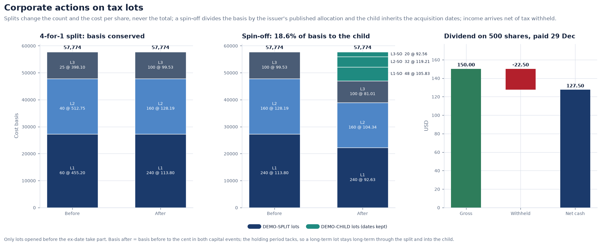

# Corporate actions: adjusting a history, and adjusting a holding

A split, a dividend or a spin-off changes what a share *is*. The day before a 4-for-1
split a share costs 400; the day after it costs 100, and nobody lost 75%. Two
different things have to be told about the event — the price history, which is
arithmetic, and the tax lots, which is tax law — and they are told in different ways.

**Implementation:** [`domain/corporate_actions.py`](../../src/meridian/domain/corporate_actions.py),
[`domain/entitlements.py`](../../src/meridian/domain/entitlements.py),
[`marketdata/adjustments.py`](../../src/meridian/marketdata/adjustments.py) ·
**Decision:** [ADR 0011](../adr/0011-corporate-action-adjustment-is-a-view.md)

---

## 1. The three dates

| Date | What it decides |
| --- | --- |
| **Ex-date** | the first day the share trades *without* the entitlement — the date the price moves |
| **Record date** | who is entitled. Under T+1 settlement (the US since May 2024) it coincides with the ex-date |
| **Pay date** | when cash or shares actually arrive — what the cash ledger cares about |

Announcement matters too: an event is known before it happens, and a system that
loads it late will disagree with the market for as long as it takes to notice.

---

## 2. Every event knows its own factor

Adjustment follows the CRSP convention: each event has a multiplicative factor *f*,
and every price **before** the ex-date is multiplied by the product of the factors of
all later events.

| Event | Price factor | Quantity factor |
| --- | --- | --- |
| Split, *n* for *d* | `d / n` | `n / d` |
| Stock dividend at rate *r* | `1 / (1 + r)` | `1 + r` |
| Cash dividend *D*, cum price *P* | `(P − D) / P` | 1 |
| Spin-off, child worth fraction *φ* | `1 − φ` | 1 (plus new child shares) |
| Rights, ratio *k* at price *S* | `TERP / P`, where `TERP = (P + kS) / (1 + k)` | 1 (unless taken up) |

Three of the five need the last cum-event close, because their size depends on the
price. That is why the factor is computed from the history rather than stored with
the event.

Two views are produced, because they answer different questions:

- **Capital** — splits, stock dividends, spin-offs and rights taken out. The price
  return a share delivered.
- **Total return** — cash dividends taken out as well, equivalent to reinvesting them
  on the ex-date. This is what performance measurement and risk models use.

The raw history is never overwritten. It is the record of what the market printed,
and a trade confirmation or a client statement has to match it.


The strongest available test of this arithmetic is the synthetic market, which knows
the true value of one original share with dividends reinvested. Through two splits
and three dividends, the total-return adjustment recovers it to within 5 basis
points — the rounding of two-decimal prices.

---

## 3. Adjusting a holding is tax law, not arithmetic

| Event | Shares | Cost basis | Holding period |
| --- | --- | --- | --- |
| Split, stock dividend | × factor | total unchanged, per share ÷ factor | **tacks** — new shares inherit the old acquisition date |
| Spin-off | parent unchanged, child shares received | divided by relative market value | tacks into the child |
| Cash dividend | unchanged | unchanged | n/a — income, less tax withheld at source |
| Rights taken up | new shares | new money at the subscription price | a *new* holding period |
| Cash merger | closed | realised gain, split long/short by each lot | ends |
| Stock merger | exchanged at the ratio | old basis − cash + gain recognised (IRC 358) | tacks |

Three details are where implementations usually go wrong:

1. **Only lots opened before the ex-date take part.** Shares bought on the ex-date
   are already post-event shares.
2. **Fractional shares are not delivered.** They are sold and paid as *cash in lieu*,
   which is a small realised gain or loss that still has to be booked.
3. **The spin-off allocation is published by the issuer** (in the US on Form 8937),
   and the basis must be divided to the cent: parent and child together must equal
   what the parent cost.



For a stock merger with cash consideration ("boot"), the reorganisation rules
recognise gain only up to the cash received:

```
realised   = cash + shares_received × acquirer_price − old_basis
recognised = min(cash, max(realised, 0))
new_basis  = old_basis − cash + recognised
```

A shareholder at a loss recognises nothing and carries the whole basis forward.

---

## 4. What happens when the event is missing

The cost of getting this wrong is asymmetric, so the quality engine checks both
directions:

- **An event that happened but was not loaded** shows up as a price jump matching a
  common ratio, and is reported as a probable unrecorded split — or, at ×100, a
  pence-and-pounds unit error.
- **An event on file whose ex-date shows no matching move** is reported too, because
  it usually means the event was loaded with the wrong date, and an adjustment
  applied on the wrong day is worse than none.

Because adjustment is a view rather than an overwrite, correcting either case is a
one-line change to the event and costs no data migration: every adjusted number moves
with it.
