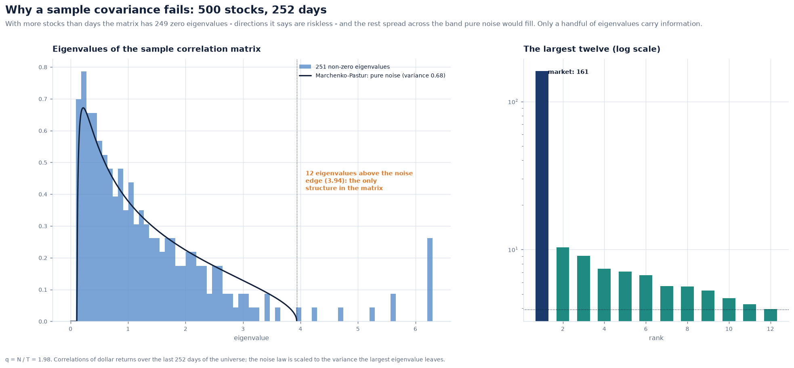
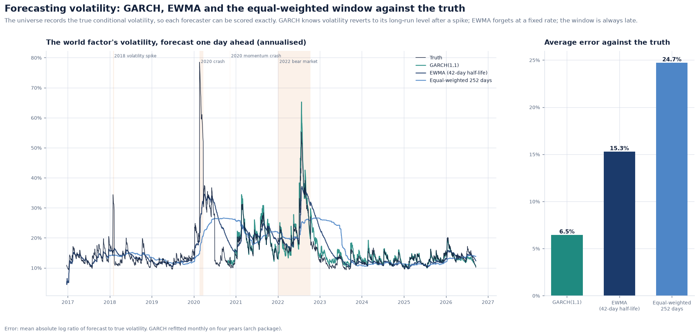
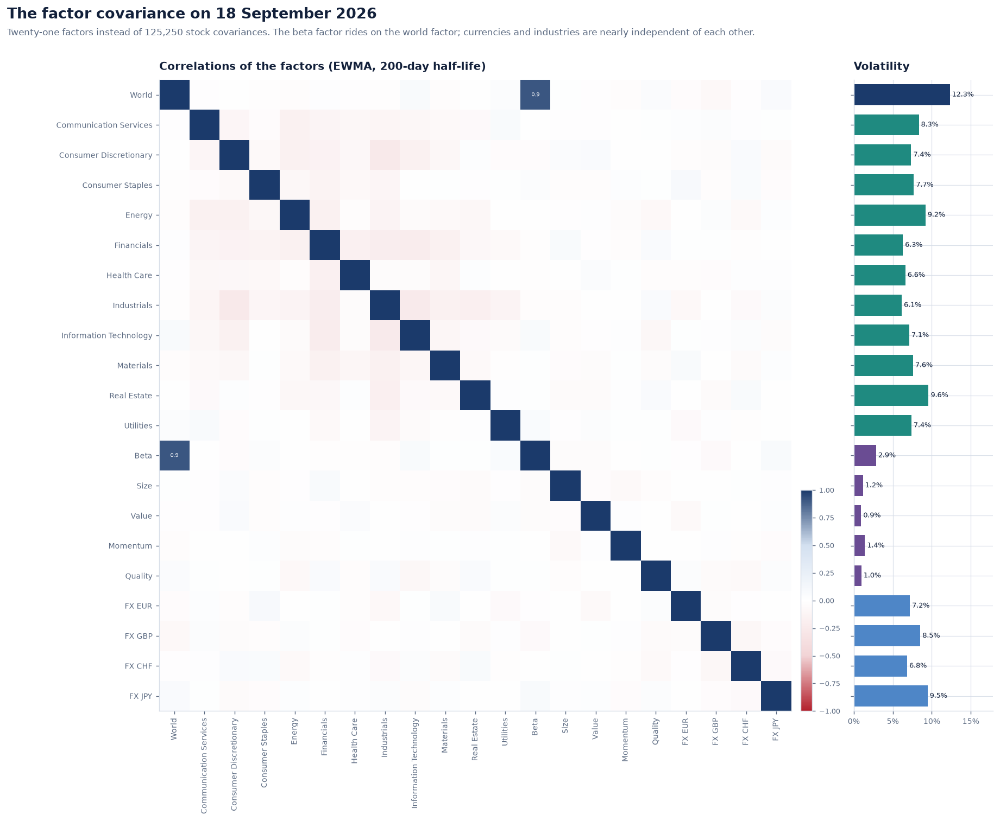
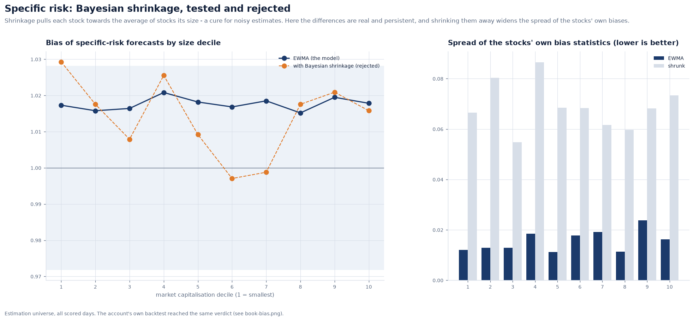

# Covariance estimation: why the sample fails, and what replaces it

The covariance matrix is the input every risk number and every optimiser depends on.
The textbook estimator, the sample covariance of past returns, is unusable at the
scale of a real portfolio. This note shows why, and measures three repairs against
each other and against the truth.

**Implementation:** [`risk/covariance.py`](../../src/meridian/risk/covariance.py),
[`risk/comparison.py`](../../src/meridian/risk/comparison.py),
[`risk/garch.py`](../../src/meridian/risk/garch.py),
[`risk/specific.py`](../../src/meridian/risk/specific.py) ·
**Decisions:** [ADR 0024](../adr/0024-ewma-factor-covariance-with-separate-half-lives.md),
[ADR 0025](../adr/0025-specific-risk-by-ewma-and-fund-basis-as-its-own-risk.md)

---

## 1. 500 stocks, 252 days

With N stocks and T days, the sample covariance has rank at most T − 1. With 500 stocks
and a year of data it is singular: 249 of its eigenvalues are exactly zero. Each of
those eigenvectors is a combination of stocks that the matrix says has **no risk at
all**.

Random matrix theory says how the other eigenvalues behave. For returns of pure noise,
the eigenvalues of a sample correlation matrix spread over the Marchenko-Pastur
interval `[σ²(1 − √q)², σ²(1 + √q)²]`, where q = N/T. Here q is 1.98. The market
eigenvalue (161) takes about a third of the variance, and the law is scaled to the
remaining variance σ² = 0.68. Almost the whole spectrum then falls inside the noise
band. Only 12 eigenvalues stand clear of it; the rest cannot be told apart from noise.



## 2. What an optimiser does with it

The fairest test of a covariance estimator is not how close its entries are to the
truth but what an optimiser builds from it. At every third month-end, each estimator
was given the last 252 days of the 500 stocks. The fully invested minimum-variance
portfolio was built from it, and two numbers were recorded: the volatility the
estimator *promised*, and the volatility the portfolio *delivered* the following month.

| Estimator | Promised | Delivered | Gross exposure |
| --- | ---: | ---: | ---: |
| Sample | 0.0% | 12.0% | 7.3× |
| Ledoit-Wolf, towards the identity | 2.9% | 10.8% | 5.9× |
| Ledoit-Wolf, towards constant correlation | 4.7% | 10.5% | 5.6× |
| **Factor model** | **8.4%** | **8.1%** | **3.0×** |

The sample finds a fully invested portfolio in its null space and promises it is
riskless; that portfolio delivered 12%. Shrinkage repairs part of the damage but still
promises less than half of what it delivers. The factor model delivers what it promises
(ratio 0.96), and it also delivers the least risk.


Two implementation notes:

- **Ledoit-Wolf** (2004, towards a scaled identity) matches scikit-learn's
  implementation to 1e-18. The constant-correlation target (2003) is the better one for
  stocks, which are all positively correlated.
- **Woodbury.** The factor model's minimum-variance weights are computed from
  `V⁻¹ = D⁻¹ − D⁻¹X(F⁻¹ + X'D⁻¹X)⁻¹X'D⁻¹`, which needs only a 21 × 21 inverse. This is
  why commercial optimisers work in the factor form and never build the 500 × 500
  matrix.

## 3. Weighting time: EWMA

Risk changes. An equal-weighted forecast over a year reacts to a crisis months late and
forgets it months late. **EWMA** weights recent days more. Meridian uses separate
half-lives:

- **42 days for volatilities**, because volatility moves fast;
- **200 days for correlations**, because the structure changes slowly, and a short
  half-life on 21 × 21 correlations would itself be noisy.

Over ten years of the estimation universe, the market portfolio's bias statistic is
1.013 with EWMA (inside the 95% band of 0.972–1.028) and 1.052 with the equal-weighted
window (outside it). See the [validation note](risk-validation.md).

## 4. GARCH: mean reversion

EWMA is a GARCH(1,1) with no long-run level. GARCH adds one, so after a spike its
forecast is pulled back towards normal:

```
σ²(t+1) = ω + α r(t)² + β σ²(t)
```

Fitted with the `arch` package (Student-t innovations), refitted monthly on four years
and filtered daily with the latest parameters, it forecasts the world factor's true
conditional volatility best of the three:

| Forecaster | Mean absolute log error against the truth |
| --- | ---: |
| GARCH(1,1) | 6.5% |
| EWMA, 42-day half-life | 15.3% |
| Equal-weighted, 252 days | 24.7% |

One caveat, stated plainly: the world factor *is* a GARCH process by construction, so
GARCH plays at home here. Against real data the margin would be smaller. The latest fit
has α = 0.034, β = 0.907 and a long-run volatility of 12.0%.



GARCH is used as the benchmark for the factor volatilities rather than as the
production forecaster. Twenty-one separately fitted GARCH models do not make a
consistent covariance matrix, and their parameters can wander from month to month. The
factor covariance itself uses EWMA ([ADR 0024](../adr/0024-ewma-factor-covariance-with-separate-half-lives.md)).



## 5. Specific risk, and a remedy that did not work

A stock's specific variance is forecast by EWMA of its own specific returns (63-day
half-life). Barra's USE4 adds **Bayesian shrinkage**: each stock's forecast is pulled
towards the average of stocks its size, and pulled harder the further it is from that
average. Meridian implements it and tested it twice.

- **On the estimation universe:** shrinkage made the spread of the stocks' own bias
  statistics more than four times wider (0.016 → 0.069). The differences between
  stocks here are real and persistent, and 63 days measure them well; shrinking erased
  information.
- **On the account:** shrinking the account's mega-caps towards the universe's size
  deciles pulled the tracking error forecast a fifth too low. The bias rose from 1.07
  to 1.22, because the prior came from a different population.

Two independent tests, one verdict: shrinkage is off by default and kept as the
documented alternative ([ADR 0025](../adr/0025-specific-risk-by-ewma-and-fund-basis-as-its-own-risk.md)).
Shrinkage is a cure for noisy estimates, and it has to be tested against the noise the
data actually has.


