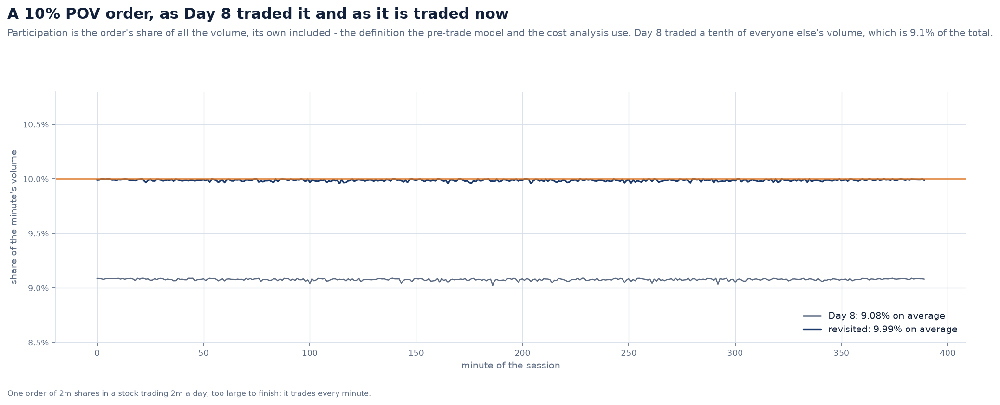
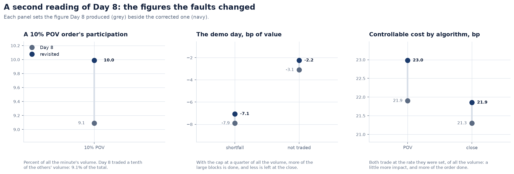
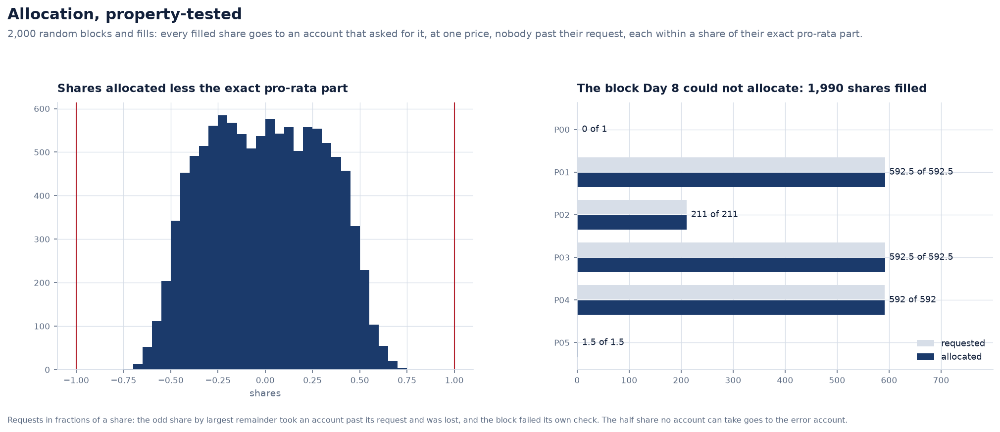
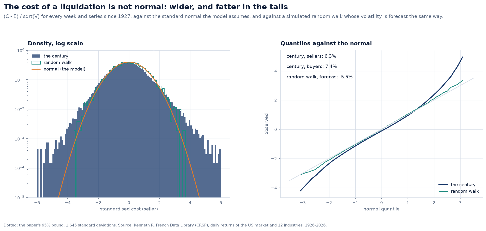

# Execution against the paper, and liquidation on a century of real prices

Day 8 built the execution desk:

- an order management system with FIX states;
- a minute-by-minute market simulator with square-root impact;
- five algorithms;
- block allocation;
- transaction cost analysis.

It also built the client report. Every test ran on the simulator, which obeys the
model's assumptions by construction. That checks the code against the model; it says
nothing about the model against the world.

This revisit uses three checks that do not share Day 8's assumptions:

1. **The paper itself.** Almgren and Chriss's (2000) worked example, run as published.
2. **A second method.** The closed-form trajectory against a conic solver, and every
   allocation and cost decomposition against properties that must hold for any input.
3. **Real prices.** The paper's liquidation through every week of the US market since
   1927.

They found four faults:

- the arrival price was taken a minute late;
- POV traded at the wrong rate;
- some blocks could not be allocated;
- the client report contained figures it did not read from anywhere, and one promise
  the platform does not keep.

They also found a property of real markets that the model leaves out.

---

## 1. Almgren and Chriss's own example

The paper's Table 1 sells one million shares of a $50 stock over five days, one trade a
day:

- σ = 0.95 $/share/day^½ (30% a year);
- ε = 1/16 (half the spread);
- η = 2.5×10⁻⁶ (impact of one spread per 1% of daily volume);
- γ = 2.5×10⁻⁷;
- λ = 10⁻⁶.

The paper states: *"For these parameters, we have from (19) that for the optimal
strategy, κ ≈ 0.6/day, so κT ≈ 3."*

| | The paper | Meridian |
|---|---|---|
| κ | ≈ 0.6 a day | 0.607 a day |
| κT | ≈ 3 | 3.04 |
| σ√T X, the position held unsold | $2.12M | $2.124M |

Along the frontier:

| Schedule | λ | Expected cost | Standard deviation |
|---|---|---|---|
| even (risk-neutral) | 0 | $0.66m | $1.04m |
| the paper's | 10⁻⁶ | $0.91m | $0.60m |
| urgent | 10⁻⁵ | $1.85m | $0.17m |

The closed form `x_j = X sinh(κ(T − t_j)) / sinh(κT)` is also checked against a conic
solver that minimises `E + λV` directly and knows nothing of sinh. On random problems
(1 to 60 intervals, λ over six orders of magnitude) no solver finds a lower objective,
and the trajectories agree to a millionth of the order.

The Almgren–Chriss engine was right. What follows is about the desk around it.

## 2. The arrival price, a minute late

Implementation shortfall has two parts:

- **delay**: from the decision price to the *arrival* price;
- **execution**: from the arrival price to the fills.

The simulator's price for a minute is the price at its end. Day 8 used:

- the open, for an order released at the open;
- the price at the end of minute *m*, for an order released at minute *m*. That is a
  minute after the order could first trade.

`MarketDay.arrival(m)` is now the price at the start of minute *m* for both. The total
shortfall is unchanged; delay and timing are now split at the same moment for every
order. A property test runs random orders through every algorithm, start time, side
and limit, and checks that the seven components add up to the shortfall computed from
the fills.

## 3. POV, at its own rate

The pre-trade model and the cost analysis measure participation as `q / (q + V)`: the
order's share of everything traded, its own included (Kissell's definition). Day 8's
POV algorithm traded `q = pV`, a share of the *rest* of the market. A 10% POV order was
therefore 9.1% by the platform's own measure, and the 25% cap was 20%.

The rates are now shares of the total: `q = pV / (1 − p)`. The figures move with it:

- **The demo day costs −7.1 bp, not −7.9 bp.** More of the large blocks is done, so the
  shares left undone at the close cost −2.2 bp, not −3.1 bp.
- **One of the three large POV blocks now finishes on the day.** It is 17.6% of daily
  volume, and 15% of all the volume on a 1.03× day is enough for it.
- **POV and Close pay a little more impact** (23.0 and 21.9 bp, from 21.9 and 21.3) and
  get more of the order done.

## 4. Allocation, property-tested

A block's fills are shared pro rata in whole shares, the odd shares by largest
remainder. Hypothesis wrote random blocks and fills. One in 3,000 could not be
allocated:

- the accounts asked for fractions of a share (592.5);
- the odd share would have taken one of them past its request;
- Day 8 capped it away, so a filled share went nowhere, and the block failed its own
  check.

The odd shares now go only to accounts with room for them. What no whole share can
place goes, in fractions, to accounts still short of their request, and less than a
share may be left for the error account.

The properties, for any block and fill:

- every filled share is allocated, or less than one is left over;
- every account gets one price;
- no account gets more than it asked;
- whole-share requests are within one share of their exact pro-rata part.

## 5. The client report

The report exists so that every number in it is the number its module produced. Day 8
typed four figures into the summary's text:

- the mandate's 6% tracking-error limit;
- the mandate's 30% active-share floor;
- "two other accounts";
- "26 block orders".

All four were true, but only until the mandate or the trade list changed. The trading
page also told the client that shares left undone were "carried to the next session".
Nothing in the platform carries an expired block, and Day 8's own note says so.

The limits are now read from the mandate's rules and the counts from the blocks, and an
expired block is reported as expired.

## 6. Liquidation on a century of real prices

Almgren and Chriss give a cost and its variance, and so a bound: the cost exceeds
`E + 1.645 √V` one time in twenty (the paper's 95% value at risk). That promise rests on
two assumptions: prices are a random walk, and the volatility is known.

`services.century_execution` runs the paper's example through **every five-day week
since 1927**, on Kenneth French's daily returns for the US market and its twelve
industries:

- **The volatility** is forecast the evening before, by RiskMetrics' EWMA (decay
  0.94, as on Day 5). It is never the week's own.
- **The realised cost** is the impact the schedule pays, which the model knows, plus
  what the real price did to the shares still held: `C = E − Σ x_k S₀ r_k`.
- **The control** is a simulated random walk. With the volatility known, the test gives
  5%. With the volatility forecast the same way, it gives 5.5%: the forecaster's own
  error.

Over 67,769 weeks (13 series):

| Schedule | Sellers over the bound | Buyers over the bound | Sellers, restated | Buyers, restated |
|---|---|---|---|---|
| even | 6.3% | 7.5% | 5.5% | 6.3% |
| the paper's | 6.3% | 7.4% | 5.4% | 6.3% |
| urgent | 6.0% | 7.0% | 5.4% | 6.3% |

The market alone, the paper's schedule, decade by decade:

| Decade | Weeks | Lag-one autocorrelation | Variance ratio | Over the bound | Restated |
|---|---|---|---|---|---|
| 1920s | 158 | +0.13 | 0.72 | 4.4% | 4.4% |
| 1930s | 597 | +0.05 | 1.07 | 6.9% | 6.5% |
| 1940s | 584 | +0.16 | 1.15 | 6.3% | 5.5% |
| 1950s | 520 | +0.13 | 1.13 | 7.9% | 5.4% |
| 1960s | 497 | +0.20 | 1.53 | 8.5% | 6.4% |
| 1970s | 506 | +0.29 | 1.54 | **10.9%** | 7.3% |
| 1980s | 505 | +0.13 | 1.10 | 5.5% | 4.6% |
| 1990s | 506 | +0.08 | 1.06 | 8.1% | 6.3% |
| 2000s | 503 | −0.06 | 0.79 | 4.4% | 4.2% |
| 2010s | 503 | −0.04 | 1.01 | 6.0% | 6.6% |
| 2020s | 334 | −0.15 | 0.85 | 5.1% | 6.0% |

What the century shows:

- **The bound broke more often than promised.** Kupiec's test (Day 5's) rejects 5% for
  the market and for the pool, at well under 0.1%.
- **The worst decades are the ones whose daily returns moved together.** From the
  1940s to the 1970s, the index's daily returns had a lag-one autocorrelation of 0.13 to
  0.29: stale prices of thinly traded stocks, and returns that took days to spread. A
  position held through such moves is riskier than its daily volatility says, by a
  variance ratio of up to 1.54. Since 2000 the correlation has turned negative, and the
  bound has held.
- **Restating the variance for autocorrelation brings most of it back.** The
  correction adds `2ρσ²τ Σ x_k x_{k+1}`, with ρ estimated over the year before (in
  `ExecutionProblem.variance(..., autocorrelation)`). The rates fall to 5.4% for sellers
  and 6.3% for buyers. The correction fails where last year's ρ is a poor forecast of
  this year's: the 2010s and 2020s get slightly worse.
- **Buyers broke it more than sellers.** The market rose over the century, which helps
  a seller and hurts a buyer, and the model assumes no drift.
- **What is left is fat tails.** The standardised cost has a standard deviation of 1.16
  and an excess kurtosis of 3.6, against 1 and 0 for the normal the model assumes.

## 7. What is simplified

- **The century study is daily.** It tests the price risk Almgren–Chriss prices, not
  the impact model; intraday trade data is not public. Impact is the paper's linear
  model, and it is the same in every week.
- **The volatility forecast is EWMA.** A GARCH forecast (Day 5) would track the tails
  better, at the cost of an estimation the paper does not ask for.
- **The correction restates the risk, not the trajectory.** With correlated moves the
  optimal schedule changes too: it trades faster when moves persist.

## References

- Almgren, R. and Chriss, N. (2000), "Optimal execution of portfolio transactions", *Journal of Risk* 3(2) — Table 1 and the efficient frontier.
- Kissell, R. and Glantz, M. (2003), *Optimal Trading Strategies*. — participation rates and the shortfall decomposition.
- Perold, A. (1988), "The implementation shortfall: paper versus reality", *Journal of Portfolio Management*.
- Kupiec, P. (1995), "Techniques for verifying the accuracy of risk measurement models", *Journal of Derivatives*.
- Lo, A. and MacKinlay, A. C. (1988), "Stock market prices do not follow random walks: evidence from a simple specification test", *Review of Financial Studies* — the variance ratio.
- French, K. R., *Data Library*: daily returns of the market and 12 industry portfolios (CRSP).
- Securities and Exchange Commission and Financial Conduct Authority (COBS 11.3) guidance on the aggregation and allocation of orders.
