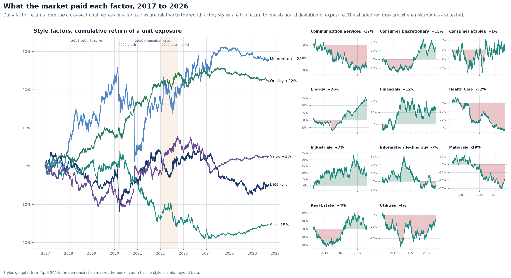
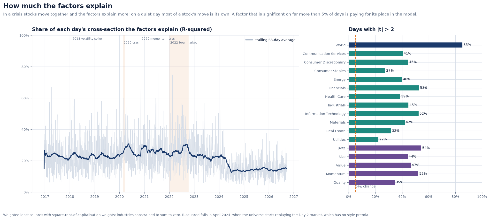
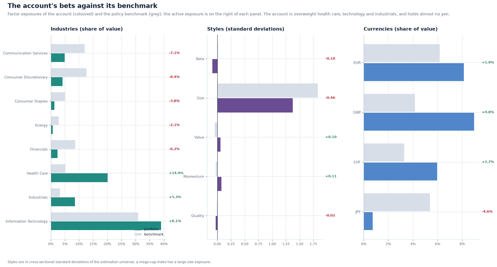

# The factor risk model: from characteristics to a covariance matrix

A risk model answers one question: how much could this portfolio move, and why?
Meridian's answer is a fundamental factor model in the tradition of Barra. It is
estimated on a 500-stock universe whose true risk is known, and then applied to the
demonstration account. This note describes how the model is built. The companion notes
cover [covariance estimation](covariance-estimation.md) and
[validation](risk-validation.md).

**Implementation:** [`risk/`](../../src/meridian/risk),
[`services/demo_risk.py`](../../src/meridian/services/demo_risk.py) ·
**Decisions:** [ADR 0023](../adr/0023-a-fundamental-factor-model-on-a-universe-with-known-truth.md),
[ADR 0025](../adr/0025-specific-risk-by-ewma-and-fund-basis-as-its-own-risk.md)

---

## 1. Why a factor model

The covariance matrix of 500 stocks has 125,250 free numbers. A year of daily data
cannot pin them down, and an optimiser will exploit every error
([covariance estimation](covariance-estimation.md) shows how badly). A factor model
replaces them with structure:

```
r_i = sum_k X_ik f_k + u_i          V = X F X' + D
```

Each stock's return `r_i` is its exposures `X_ik` times the factor returns `f_k`, plus a
specific return `u_i` that belongs to that stock alone. The covariance `V` then needs
only the 21 × 21 factor covariance `F` and 500 specific variances `D`.

## 2. The factors

| Group | Factors | Exposure |
| --- | --- | --- |
| World | 1 | one for every stock |
| Industry | the 11 GICS sectors | one for the stock's sector |
| Style | beta, size, value, momentum, quality | standardised characteristic |
| Currency | EUR, GBP, CHF, JPY | the share held in that currency |

**Styles** come from descriptors observed each morning, not from regressions on past
returns:

- **Beta:** a one-year regression on the market, weighted towards recent days (63-day
  half-life) and shrunk towards the average (Vasicek). A beta measured with a large
  standard error is pulled the most.
- **Size:** the logarithm of market capitalisation.
- **Value:** the logarithm of book-to-price.
- **Momentum:** the return over the last year, excluding the most recent month.
- **Quality:** return on equity.

Each descriptor is winsorised and **standardised**: the capitalisation-weighted market
has zero exposure to every style, and one unit is one cross-sectional standard
deviation. An exposure of +1.4 to size therefore means "1.4 standard deviations larger
than the average stock, weighted by value", and it means the same thing for every
stock and every day.

## 3. The daily regression

Every day, the stocks' local returns are regressed on the exposures they had that
morning. The coefficients are the day's factor returns; the residuals are the specific
returns. Three details matter:

- **Weights.** Weighted least squares with weights proportional to the square root of
  market capitalisation, roughly the inverse of specific variance. Small, noisy stocks
  do not dominate, and neither do the few largest.
- **The industry constraint.** The world column is the sum of the industry columns, so
  the unconstrained regression is singular. The constraint that cap-weighted industry
  returns sum to zero removes the redundancy and gives the factors their meaning: the
  world factor is the market, and an industry factor is how the industry did
  *relative* to it. The constraint is imposed exactly, by substitution, not as a
  penalty; a test recovers known factor returns to 1e-12.
- **Timing.** Exposures are those known at the start of the day. Using end-of-day
  exposures would let the day's return leak into its own explanation.

Currency returns are not estimated: they are observed.



## 4. A universe whose truth is known

With real data a risk model is judged against realised volatility, which is itself a
noisy estimate. Meridian's estimation universe removes that excuse. It has 500
synthetic stocks over ten years, with GARCH Student-t factors and residuals, and it
records every true factor return, exposure and conditional variance. Its regimes are
where risk models are tested:

- a crash in February–March 2020 (world −32%, volatility four times normal);
- a 2022 bear market (world −25%, value +8%);
- a momentum crash in November 2020 (momentum −12% in a week);
- a volatility spike in February 2018 (world −10%).

The recovered factors track the true ones closely. Before the replayed window, World
has correlation 0.989 with its true path, and the styles 0.91–0.97. Beta's volatility
comes out slightly low (4.7% against 5.0%), because betas can only be measured with
error: the errors-in-variables effect. The regressions
explain 24% of each day's cross-section on average before April 2024, more in crises
when stocks move together.



**Over the demonstration window** (April 2024 – September 2026) the universe *replays*
the Day 2 market that moved the account: its world factor and its GARCH variance, its
sector moves, and its exchange rates. The Day 2 market has no size, value, momentum or
quality premia, so those factors are silenced there. Only beta, which rides on the
world factor, remains. This is why R-squared falls in 2024 and why the style lines go
flat. It is the model correctly learning that the market it now faces has no style
premia.

## 5. Coverage: the stocks the account actually holds

The regression uses the **estimation universe**. The account and its benchmark hold the
**coverage universe**, as at a real asset manager:

- **The benchmark's 36 stocks and the book's own holdings.** Exposures are computed
  from their own descriptors, standardised on the estimation universe's scale, so
  +1.4 means the same thing for both. Specific risk comes from their own residuals.
- **Index funds** are looked through to the benchmark's constituents, as in the Day 4
  attribution. What the look-through does not explain (the fund's return less its
  constituents') is carried as its own line, the fund's **basis**, with its own
  specific risk. Leaving it out was the first thing the backtest caught.
- **The Treasury bond**, which no equity model explains, gets a time-series beta to the
  world factor and the rest of its variance as specific risk.
- **Cash** carries only its currency.

## 6. What the model says about the account

On 18 September 2026, with the account's positions and a NAV of 5.03 million dollars:

| | Portfolio | Benchmark | Active |
| --- | ---: | ---: | ---: |
| World | 8.11% | 8.71% | 0.00% |
| Industry | 0.77% | 0.48% | 0.48% |
| Style | 0.04% | 0.47% | 0.08% |
| Currency | 0.03% | 0.05% | 0.07% |
| Specific | 3.27% | 1.85% | 5.19% |
| **Total** | **12.22%** | **11.56%** | **5.81%** |

Each column is an Euler decomposition, so its parts add up to its total exactly. The
account's volatility is mostly the market: its world exposure of 0.81 matches the
benchmark's, because both hold about 80% equities. Its tracking error of 5.8% is almost
entirely stock-specific. That is the price of holding BAE Systems, Bayer, Roche and
Johnson & Johnson at six to thirty times their index weights, and a stock the index does
not hold at all. Microsoft and Apple, held close to their index weights, contribute most
to volatility. BAE Systems, the split stock and Bayer contribute most to tracking error,
followed by the US fund's basis.



