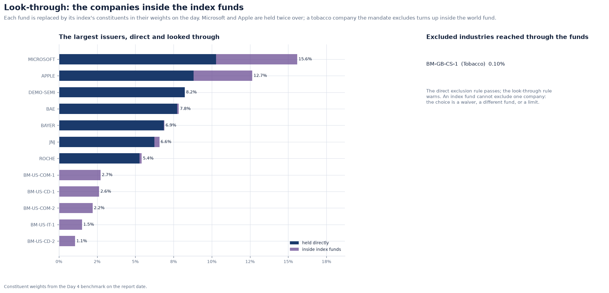
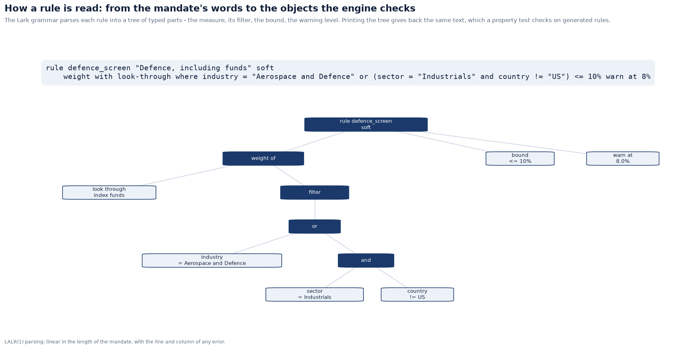
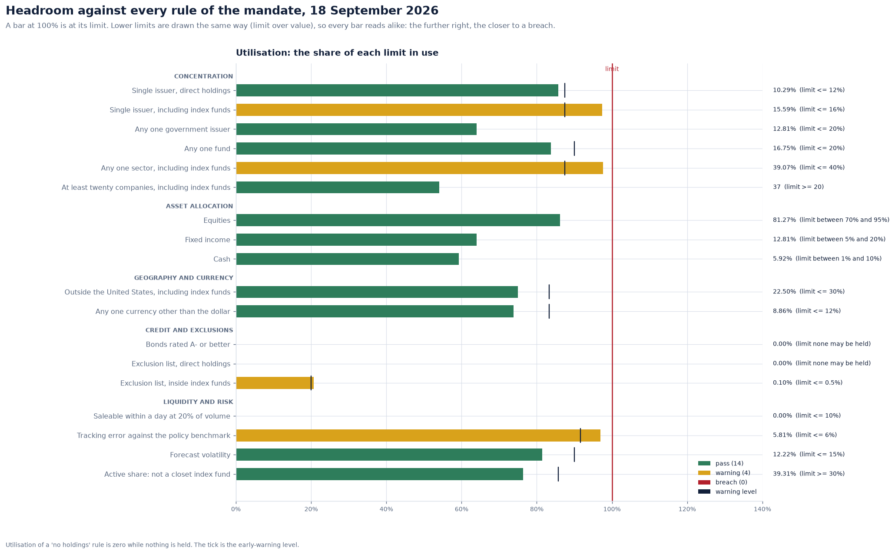
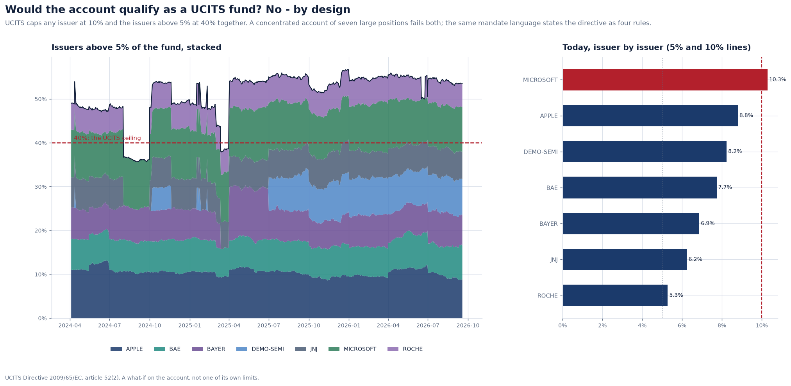

# The mandate language: investment restrictions as rules a machine can check

An investment management agreement is a contract. Its schedule of restrictions says
things like "no more than 10% of the fund in any one issuer" and "bonds must be rated
A- or better". Written in prose, those sentences are checked by people, and different
people check them differently. Meridian writes them in a small language that is exact
enough to run and plain enough for a compliance officer to read.

**Implementation:** [`compliance/grammar.lark`](../../src/meridian/compliance/grammar.lark),
[`compliance/language.py`](../../src/meridian/compliance/language.py),
[`compliance/parser.py`](../../src/meridian/compliance/parser.py),
[`compliance/engine.py`](../../src/meridian/compliance/engine.py) ·
**Mandates:** [`global_equity_core.mandate`](../../src/meridian/compliance/mandates/global_equity_core.mandate),
[`ucits_screen.mandate`](../../src/meridian/compliance/mandates/ucits_screen.mandate) ·
**Decisions:** [ADR 0027](../adr/0027-mandates-are-written-in-a-language-parsed-by-lark.md),
[ADR 0028](../adr/0028-look-through-is-part-of-the-rule.md)

---

## 1. A rule

```
rule issuer_look_through "Single issuer, including index funds" soft
    max weight by issuer with look-through where asset_class = "equity" <= 16% warn at 14%
```

Every rule has five parts:

- an **identifier**, and optionally a title;
- a **severity**: `hard` limits block a trade, `soft` limits need a recorded override;
- a **measure**: what to compute on the portfolio;
- a **bound**: `<=`, `>=`, `<`, `>`, `=` or `between … and …`;
- optionally a **warning level**: the early-warning line a compliance team watches
  before the limit itself.

## 2. Measures

| Measure | Meaning | Example |
| --- | --- | --- |
| `weight where F` | total weight of the holdings that match F | cash between 1% and 10% |
| `max weight by G where F` | the weight of the heaviest group | any one issuer ≤ 12% |
| `sum weight by G above X where F` | the combined weight of groups each above X | UCITS 5/10/40 |
| `count where F` | the number of holdings | at least 20 companies |
| `no holdings where F` | none may be held (the limit is zero) | the exclusion list |
| a metric | a number from the risk model | tracking error ≤ 6% |

Filters combine comparisons (`=`, `!=`, `<`, `<=`, `>`, `>=`) and memberships
(`in (…)`, `not in (…)`) with `and` and `or`; `and` binds tighter, and parentheses
group. Fields are `asset_class`, `sector`, `industry`, `issuer`, `country`,
`currency`, `rating`, `instrument`, `days_to_liquidate` and `weight`.

**Ratings compare by credit quality**, not alphabetically: `rating < "A-"` means worse
than A-. **A holding without an attribute does not match a condition on it.** An
equity without a rating is not "below BBB-", and a bond without a sector is not "in
Energy". That is what a mandate means; the reverse would flag every stock as junk.

## 3. Look-through is part of the rule

`with look-through` replaces each index fund by its index's constituents, in their
weights on the day. The difference is not academic. On the report date the account
holds Microsoft at **10.29%** directly, and at **15.59%** once the Microsoft inside the
S&P 500 and world funds is counted. Whether a limit applies to direct holdings or to
the looked-through exposure is a decision the mandate has to make. The language makes
it say so, rule by rule ([ADR 0028](../adr/0028-look-through-is-part-of-the-rule.md)).

The account's mandate uses both. The hard single-issuer limit (12%) is on direct
holdings, where the portfolio manager can act at once. A soft limit (16%) is on the
looked-through exposure, where acting means selling a fund.



The same applies to exclusions. The direct exclusion rule passes. The look-through rule
finds **0.10%** of the account in a UK consumer goods company classed as tobacco,
reachable only inside the world index fund. An index fund cannot exclude one company;
the choice is a waiver, a different fund, or a limit on indirect exposure. The mandate
chooses a limit: at most 0.5%, with a warning at 0.1%.

## 4. Parsing with Lark

The grammar is LALR(1), so parsing is linear in the length of the mandate. An error is
reported with its line, its column and what was expected there:

```
$ meridian compliance parse 'rule cap hard max weight by colour <= 5%'
error line 2, column 29: cannot read 'rule cap hard max weight by colour <= 5%'; expected one of FIELD
```

The parser also enforces the meaning of a rule:
- a warning level must come before its limit;
- a range cannot be empty;
- `no holdings` takes no bound;
- only groupable fields may follow `by`;
- identifiers must be unique within a mandate.

Limits are read exactly, as `Decimal`: `9.5%` is 0.095, not 0.0949999… Values at a
limit are compared with a 1e-12 tolerance, so a weight that is exactly 10% after
floating-point arithmetic is not a breach of "≤ 10%".



## 5. Text in, text out

`to_text` prints a rule as it would be written, and it is the parser's exact inverse. A
Hypothesis test generates hundreds of random rules and requires
`parse(to_text(rule)) == rule` for each: every measure, nested `and`/`or` filters,
memberships, bounds of every shape. So a rule stored in the database as text, with its
SHA-256 hash, is the same rule that was checked, and a change to its wording is a new
version, never a silent edit.

## 6. The account's mandate

The Global Equity Core mandate has 18 rules in five groups:
- **concentration:** direct and looked-through issuer limits, any one government
  issuer, any one fund, any one sector, and a minimum of twenty companies;
- **asset allocation bands:** equities 70–95%, fixed income 5–20%, cash 1–10%;
- **geography and currency;**
- **credit quality and the exclusion list;**
- **liquidity and risk:** days to liquidate at 20% of average daily volume, and
  tracking error, forecast volatility and active share from the Day 5 risk model.

On 18 September 2026, 14 rules pass and 4 warn: the looked-through issuer limit
(97% used), the sector limit (98%), tracking error (97%) and indirect exclusions.
None is breached.



## 7. The same language, another rulebook

The UCITS Directive's diversification rules are four lines in the same language
(`ucits_screen.mandate`):
- no issuer above 10%;
- issuers above 5% together at most 40%;
- any one government issuer at most 35%;
- any one fund at most 20%.

Run as a what-if, they say the account would not qualify as a UCITS fund.
Microsoft is at 10.3%, and the seven issuers above 5% add up to 53.5%. That is by
design: it is a concentrated account, not a retail fund.


