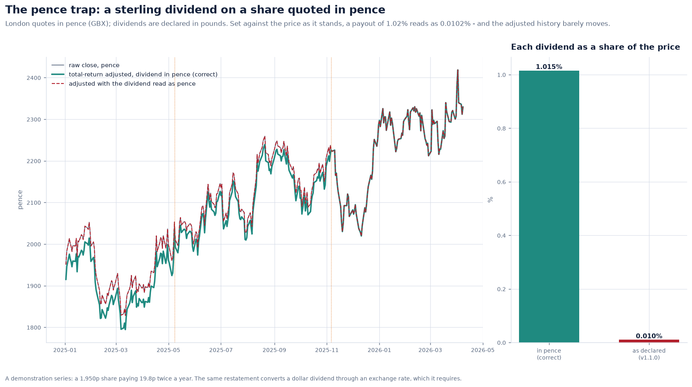
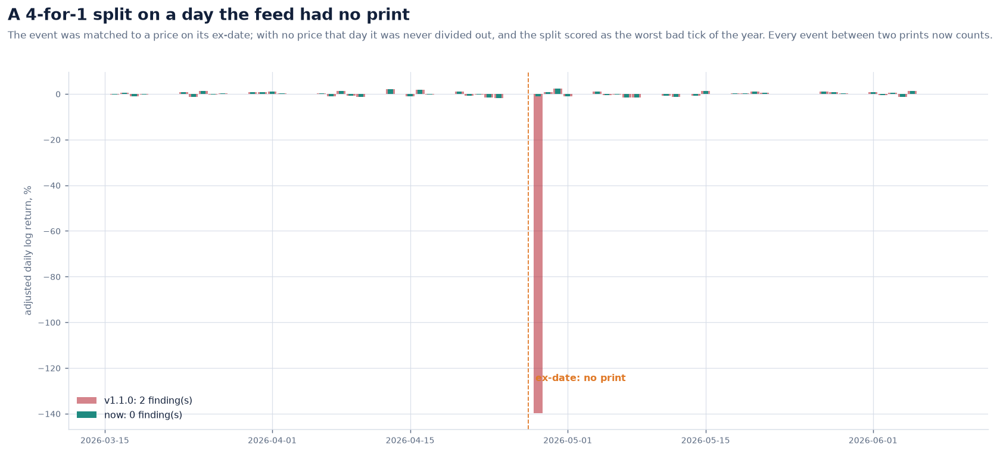
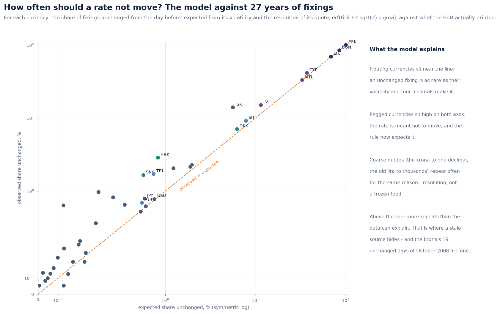
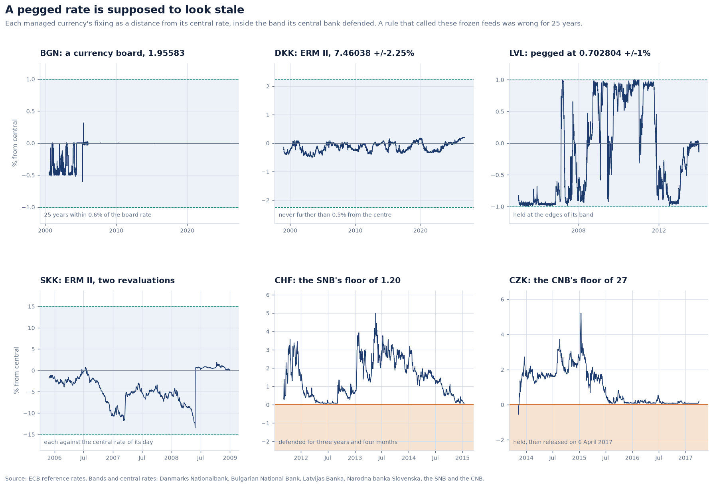
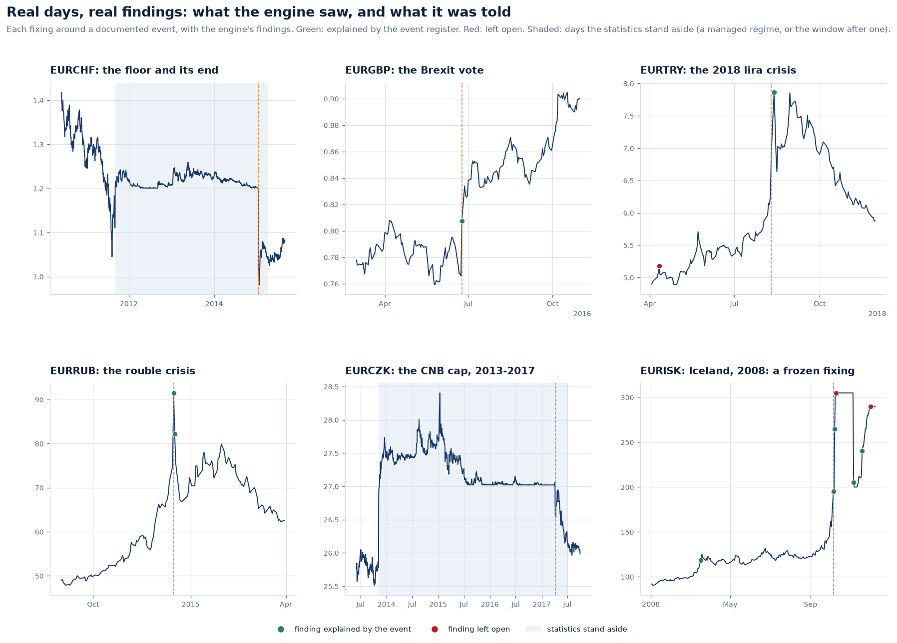
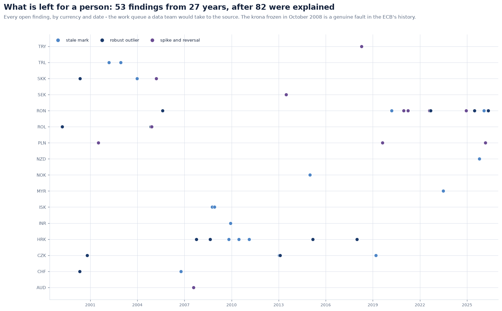
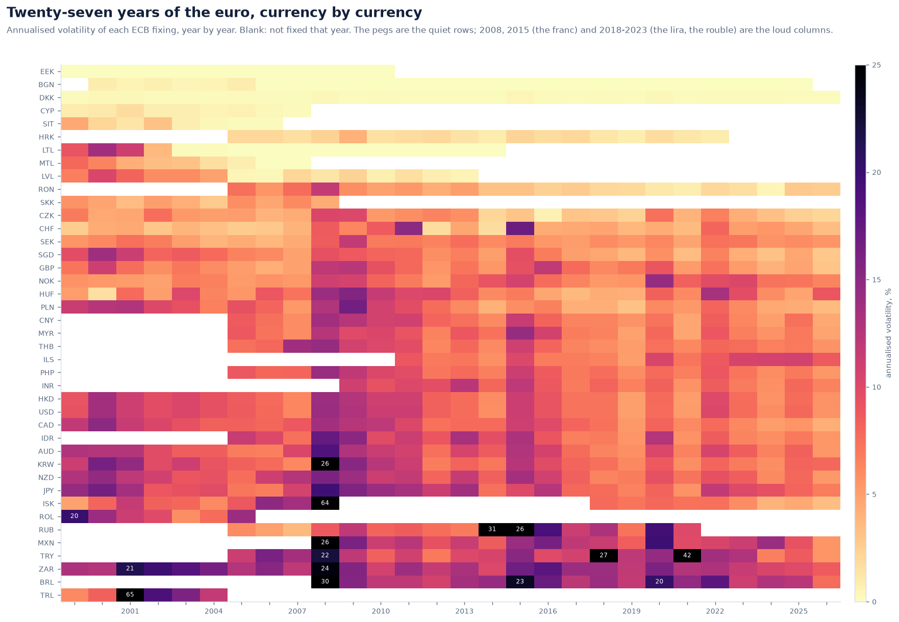
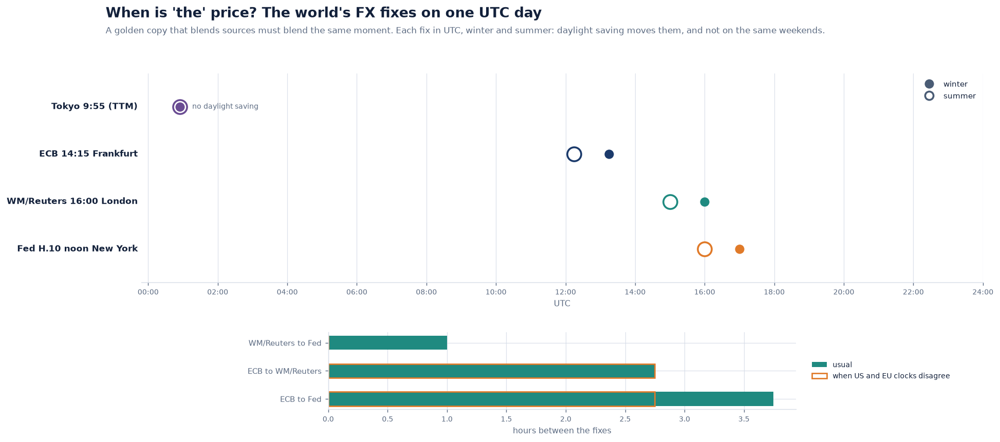

# Market data on real FX: what 27 years of central bank fixings taught the quality engine

Day 2 measured its quality rules against a synthetic market. Faults were planted, and
recall and precision were scored against them, which is the right way to *measure* a
detector. It has one blind spot: a synthetic market contains only the problems its
author thought of.

This note records what happened when the same machinery met real data:

- every euro reference rate the ECB has fixed since 4 January 1999, 41 currencies and
  221,093 fixings;
- the Federal Reserve's noon rates for the same pairs.

It also covers four faults found by reading the Day 2 code again.

---

## 1. Four faults found in review

**The pence trap.** London quotes most shares in pence (GBX), Johannesburg in cents
(ZAc), Tel Aviv in agorot (ILA). Dividends, however, are declared in the currency:
pounds, rand and shekels. Day 2 set a dividend against a price without asking what
either was denominated in.

Take a GBP 0.198 dividend on a 1,950p share:

- it is a **1.02%** payout;
- read naively it was **0.01%**, and the total-return history barely moved.

`core.currency.QuoteUnit` now names the unit a price is quoted in. Every dividend is
restated in that unit before its factor is taken:

- by the hundred, when the currencies match;
- through an exchange rate, when they do not. The rate is required, and its absence
  is an error, not a guess.

**Events on days without a print.** Corporate actions were matched to the
observation *on* their ex-date. When the feed had no price that day (a missing
print, or a holiday in the feed's calendar), the event was never divided out. A
routine 4-for-1 split then scored as the worst bad tick of the year: one robust
outlier and one "unrecorded split". Returns and the unexplained-jump rule now take
every event between one observation and the next.

**Gaps against the market.** A return spanning two missing prints is three days of
movement, but it was set against one day of the market proxy. The proxy itself was
built from returns of any span. Now:

- residuals subtract the market's move over the whole span;
- the leave-one-out proxy uses only one-session returns.

**The MAD constant** was 1.4826. The consistent estimator of the standard deviation
uses 1/Φ⁻¹(3/4) = 1.482602218…, which is what `scipy.stats.median_abs_deviation`
uses, and the two now agree exactly.

---

## 2. The rules on real data: 1,282 findings

Run unchanged over the ECB's history, the FX rules raised **1,282 findings**. A data
team handed that list would learn to ignore it. Reading the findings shows why: most
were not faults in the data. They were facts about currencies that the rules had
never been told.

| The rules are told | Findings left | What changed |
| --- | ---: | --- |
| nothing (as written for share prices) | 1,282 | |
| the resolution of the quote | 560 | a fixing printed to four decimals cannot move by less than a tick |
| each currency's lifecycle | 546 | no fixings after the euro, a redenomination, or during a suspension |
| each currency's regime | 135 | pegs, bands, crawls and floors are judged against the band |
| the register of market events | **53 open**, 82 explained | documented days explain their findings |

### 2.1 Resolution

The Bulgarian lev was held at 1.95583 to the euro by a currency board, and the ECB
printed 1.9558 almost every day for a quarter of a century. Against a window of
identical fixings, the median absolute deviation is **zero**. A one-tick wobble of
the rounding then scores as "infinitely many" deviations, and the v1.1.0 rules raised
hundreds of findings on the lev, the Cypriot pound and the lats for exactly that.

A price cannot move by less than one tick of its quote. The robust scale is floored
at that tick, expressed as a return, and **measured locally**. The ECB quoted the
krona to two decimals in 1999 and to one decimal later, so a single resolution for
the history would be wrong at one end. The finest step among the twenty prints
before each return is used, and trailing zeros count: 1,202,000 old lira resolves to
a thousand.

Staleness becomes a probability rather than a count. With daily volatility σ and a
tick of *t*, the chance that a print lands on the same tick as the last is about

$$p = \operatorname{erf}\left(\frac{t}{2\sqrt{2}\,\sigma}\right)$$

A run of *k* repeats is flagged only if *p*ᵏ is below one in a thousand:

| A currency | How the rule treats its repeats |
| --- | --- |
| a share moving 1.5% a day | flagged after two repeats, as before |
| the krona, quoted to one decimal | needs a longer run |
| a pegged rate, whose volatility is its rounding | never flagged |

The model can be checked against the data, and it holds. For every currency, the
expected share of unchanged fixings sits close to the share the ECB actually printed.

### 2.2 Lifecycle

Nine currencies became the euro during the history. In every case the last ECB
fixing equals the irrevocable conversion rate, and a test checks it:

| Currency | Joined the euro | Conversion rate |
| --- | --- | --- |
| Slovenian tolar | 1 January 2007 | 239.640 |
| Cypriot pound | 1 January 2008 | 0.585274 |
| Maltese lira | 1 January 2008 | 0.429300 |
| Slovak koruna | 1 January 2009 | 30.1260 |
| Estonian kroon | 1 January 2011 | 15.6466 |
| Latvian lats | 1 January 2014 | 0.702804 |
| Lithuanian litas | 1 January 2015 | 3.45280 |
| Croatian kuna | 1 January 2023 | 7.53450 |
| Bulgarian lev | 1 January 2026 | 1.95583 |

Two currencies were redenominated: the Turkish lira in 2005 at a million to one, and
the Romanian leu in 2005 at ten thousand to one. Two fixings were suspended:

- **the krona**, from December 2008 after Iceland's banking collapse, resumed on
  1 February 2018;
- **the rouble**, from March 2022.

Every one of the 13 "missing days" findings was one of these. A suspension also hides
a subtler fault. The first krona fixing after the gap is 57% below the last one
before it, and the rules scored that as one day's return. No return is now taken
across an inactive period.

### 2.3 Regime

`refdata.currency_regimes` records how each currency was managed against the euro:

- **currency boards:** the lev, the kroon and, from 2002, the litas;
- **ERM II bands:** the krone at ±2.25%, and the Cypriot, Maltese, Slovak, Croatian
  and Bulgarian bands at ±15%;
- **unilateral and crawling pegs:** the lats, the forint, the tolar and the old lira;
- **floors:** the Swiss National Bank's minimum of 1.20 per euro, and the Czech
  National Bank's cap at 27 koruna.

Every managed rate stays inside its band in the real data, and a test checks that
too.

Under a managed regime the central bank, not the market, decides where the rate sits.
A statistical outlier test asks the wrong question there. Statistics stand aside, and
the new `PegBand` rule asks the right one: is the fixing inside the band?

Statistics also stand aside for 60 fixings after a regime ends, while the trailing
window still holds the managed period. Three years of a defended floor leave a
window so flat that every ordinary move after its removal looks like a hundred
deviations.

### 2.4 Events, and what is left

Some days really were extraordinary. A register of 31 documented events attaches each
finding on such a day to the event that explains it. Among them:

- the Swiss National Bank's floor and its removal;
- the Brexit vote;
- Lehman;
- Turkey's float of 2001 and its lira crises of 2018 and 2021;
- the rouble in 2014;
- Romania's 2025 election.

A finding explained this way stays in the report, labelled; nothing is dropped.

**53 findings are left for a person**, across 27 years and 41 currencies. They are
the work queue a data team would take to the source. Among them is a genuine fault in
the ECB's own history: in October 2008, as Iceland's banks failed, the krona fixing
stood at 305 for 19 consecutive days and then at 290 for six more. No market produced
those numbers. It is exactly what a staleness rule exists to find, and the
regime-aware rule still finds it.

---

## 3. Two central banks, one exchange rate

The Federal Reserve publishes noon buying rates in New York for the same pairs: an
independent second source. Over 27 years the ECB's 14:15 Frankfurt fix and the Fed's
noon fix differ by:

| Pair | Median gap | Correlation with the next ECB move |
| --- | ---: | ---: |
| EURUSD | 18 bp | 0.63 |
| GBPUSD | 17 bp | 0.59 |
| USDCHF | 20 bp | 0.60 |
| USDJPY | 17 bp | 0.56 |

The gap is not an error. The later fix has seen more of the day, and it already shows
part of tomorrow's ECB move, a correlation of about 0.6. The largest gaps fall on news
that arrived between the two fixes:

- 10 March 2016: the ECB's easing, announced at 13:45 Frankfurt time, and the press
  conference that followed;
- the US inflation surprise of 10 November 2022;
- the Bank of Japan's intervention of 21 October 2022.

For a golden copy this is decisive. Two sources fixed hours apart do not disagree;
they answer different questions. Blended, they add 18 bp of noise. Compared, they
raise a "challenge" on every news day. A `PricingPolicy` can now name each source's
`FixingTime`. A source fixed more than an hour from the anchor is set aside with that
reason, not counted as disagreeing.

The gap is measured in UTC on the day:

- **usually 3h45** between Frankfurt and New York;
- **2h45** in the weeks each spring and autumn when US and European daylight saving
  disagree.

---

## References

- European Central Bank, *Euro foreign exchange reference rates*, and the Council of
  the EU's regulations fixing the conversion rates of each euro adoption.
- Board of Governors of the Federal Reserve System, *H.10 Foreign Exchange Rates*.
- P. J. Rousseeuw and C. Croux, "Alternatives to the Median Absolute Deviation",
  *Journal of the American Statistical Association* 88(424), 1993.
- IMF, *Annual Report on Exchange Arrangements and Exchange Restrictions*, for the
  regime classifications.
- London Stock Exchange, on pence (GBX) as the quotation unit for UK equities.
