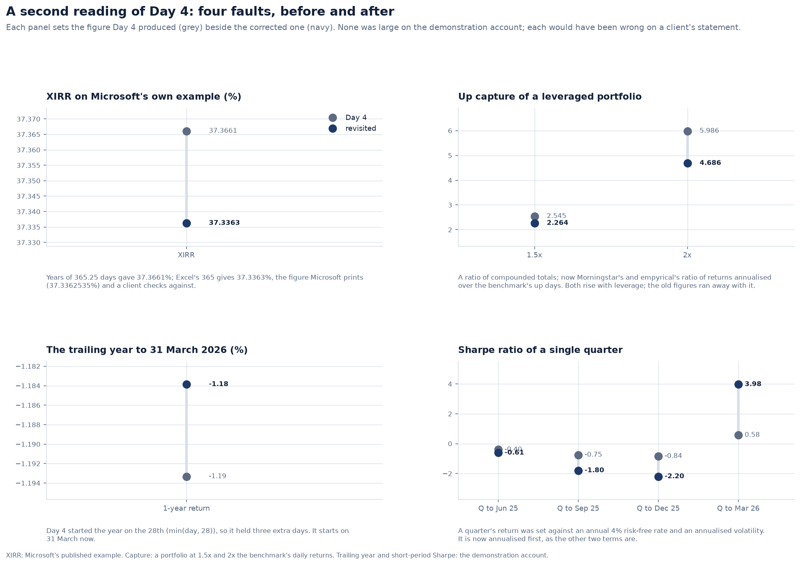
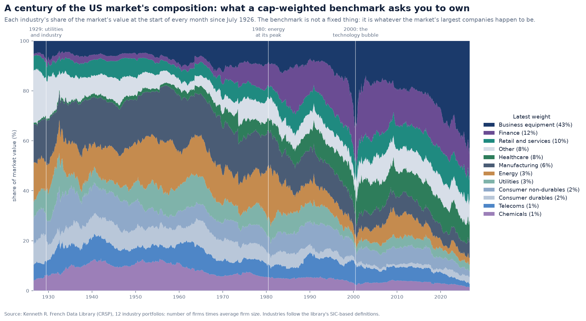
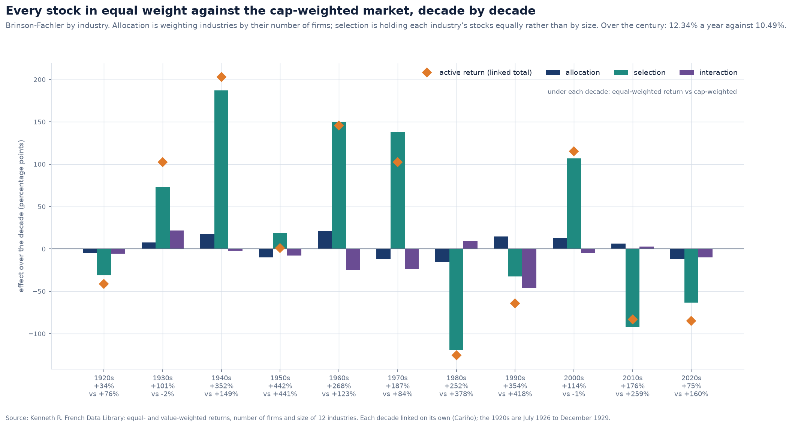
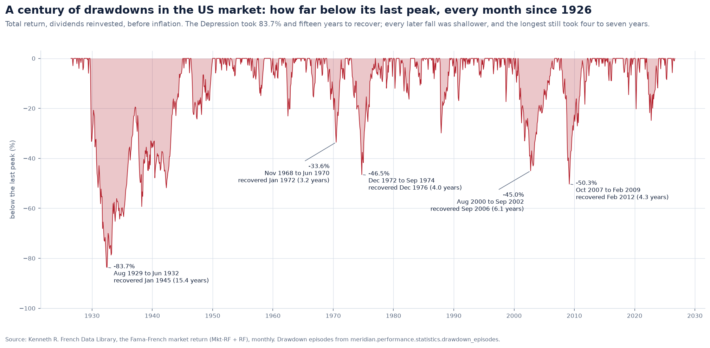
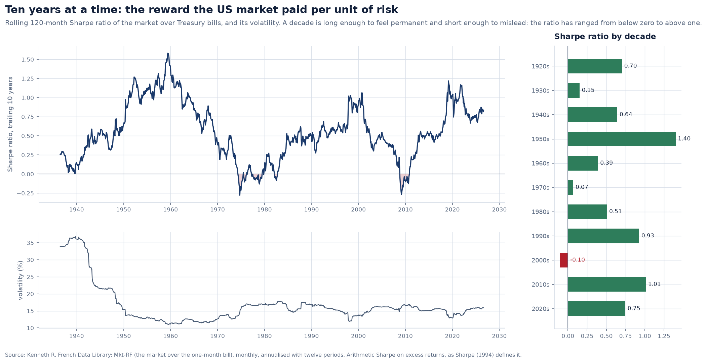

# Performance against the references, and on a century of real returns

Day 4 measured the demonstration account's performance and explained it against a
synthetic benchmark. Every check was written from the definitions by the same hand as
the code. This revisit tests the module against references that do not share that hand:

1. **a second reading of the code**, which found six faults;
2. **empyrical**, the performance library behind pyfolio and zipline, and **scipy**,
   measure by measure;
3. **Microsoft's published XIRR and XNPV examples**;
4. **a century of real US equity returns** from Kenneth French's data library, used to
   rebuild a cap-weighted benchmark from its constituents and to attribute against it.

It also adds three linking methods to Cariño's, and finds out how much the choice
matters.

---

## 1. Six faults in a second reading

- **The trailing year was three days too long.** Its start was
  `date(year - 1, month, min(day, 28))`, so the year to 31 March began on 28 March. It
  now starts on the same date a year earlier, and a month end maps to a month end: the
  year to 28 February 2025 starts on 29 February 2024.
- **The Sharpe and Sortino ratios of a short series mixed units.** For a period under
  a year, the GIPS rule keeps the *presented* return unannualised. The ratios inherited
  that return, and set a quarter's return against an annual risk-free rate and an
  annualised volatility. Ratios now always use the annual rate (`annual_rate`); the
  presented return still follows GIPS (`annualise`).
- **Relative measures annualised over the wrong span.** Portfolio and benchmark were
  aligned on their shared days, but annualised from the earlier start to the later end.
  Both now cover only the period the shared days span.
- **XIRR counted years of 365.25 days**, although the Day 4 note said actual/365. Excel
  counts 365, and so does every
  spreadsheet a client checks against. The function now uses actual/365, and
  Microsoft's examples are reproduced:
  - XIRR of 37.3362535%. Excel iterates to 0.000001%, so its printed figure is 1.5e-9
    from the exact root;
  - XNPV of 2,086.6476 at 9%.
  `xnpv` is new.
- **Capture ratios divided compounded totals.** Morningstar and empyrical divide the
  portfolio's return *annualised over the up (or down) periods* by the benchmark's.
  The ratio of totals overstates the capture of anything that compounds faster: 5.99
  against 4.69 for a portfolio at twice the benchmark.
- **A Modified Dietz flow on the opening date was weighted above one.** Flows outside
  the period `(start, end]` are now refused.

A return series also carries its **origin**, the valuation it is measured from (the
Friday before a Monday, the month end before a monthly return), and its **frequency**.
Monthly data annualises with twelve periods, not 252.

## 2. Every measure against empyrical

Fifteen measures are computed both ways on two datasets:

- the demonstration account against its policy benchmark, daily, with a 4% risk-free
  rate;
- the equal-weighted US market against the published market, monthly since 1926.

Of the 30 comparisons, **22 agree to 1e-10**. The other 8 differ by one of four
conventions:

| Measure | Meridian | empyrical |
|---|---|---|
| annual return | calendar time, (1 + R)^(365.25 / days) - 1, not annualised under a year (GIPS) | period count, (1 + R)^(periods / n) - 1 |
| Sharpe ratio | annual rate less the risk-free rate, over annualised volatility | mean excess return over its standard deviation, times the root of periods per year |
| Sortino ratio | as Sharpe, over the downside deviation | as Sharpe, over the downside deviation |
| alpha | Jensen's alpha on annual rates | the mean regression residual, compounded |

An explanation alone does not close a break. For each convention, the measure is also
**recombined from Meridian's own building blocks the way empyrical computes it**, and
that figure must agree with empyrical's to 1e-10. Every gap is therefore accounted for
to the last digit, not just described.

The conventions matter. Over the century, the equal-weighted market's alpha against
the market is **−0.42% under Jensen's form and +0.44% under the regression's**: the
sign depends on the definition.

## 3. A benchmark rebuilt from its constituents

French publishes, for twelve industry portfolios covering every NYSE, AMEX and NASDAQ
stock:

- value- and equal-weighted returns;
- the number of firms;
- their average size at the start of each month.

Number times size is each industry's market value, so the market can be rebuilt as a
capitalisation-weighted index of its industries. Index providers run the same test on
their own replication.

Over 1,202 months the rebuilt market tracks the published market factor to **11 bp a
month (rms), with a correlation of 0.99979**. The largest gap is March 2000, +175 bp,
at the top of the technology bubble, when the two tables' universes differed most.
Compounded over a century, $1 becomes $21,951 rebuilt against $19,717 published.

The weights themselves are worth seeing. A cap-weighted benchmark is not a fixed thing:
it is whatever the largest companies are. Business equipment is 43% of the market today.

## 4. Brinson on a century: equal weight against cap weight

The equal-weighted market holds every stock in equal weight, the purest small-company
tilt there is. Attributed against the cap-weighted market by industry, Brinson-Fachler
splits its active return into two decisions:

- **allocation**: weighting industries by their number of firms rather than their
  value;
- **selection**: holding each industry's stocks equally rather than by size.

Over the century the equal-weighted market earned **12.34% a year against 10.49%**, and
almost all of the difference is selection. Small companies within each industry beat
large ones. The decades disagree:

- in the 2000s the equal-weighted market gained 114% while the cap-weighted lost 1%;
- in the 2010s and 2020s, the decades of the largest companies, selection cost 92 and
  63 points.

## 5. Four linking methods

Monthly effects compound into the period's active return only if they are linked.
`performance.linking` implements four methods; all are exact:

- **Cariño (1999)**, the default;
- **Menchero (2000)**;
- **GRAP (1997)**;
- **Frongello (2002)**. Its recursion unrolls to GRAP's formula, so each effect's
  total is the same. What differs is that Frongello's running totals need no future
  returns.

Over the last twelve months the methods differ by about 50 bp of an effect (allocation: 109 bp under Cariño, 56 under Menchero). Over the
century they move up to a fifth of the answer between effects:

| Method | Allocation | Selection | Interaction |
|---|---|---|---|
| Cariño | 7% | 107% | -14% |
| Menchero | 12% | 107% | -19% |
| GRAP and Frongello | 10% | 125% | -36% |

The choice of method is a modelling decision. An attribution report should state which
method it used, and Meridian's results now record it.

## 6. Risk on a century of returns

The deepest falls since 1926:

| Fall | Depth | Time to recover |
|---|---|---|
| 1929-32 | -83.7% | 15.4 years, to January 1945 |
| 2007-09 | -50.3% | 4.3 years |
| 1973-74 | -46.5% | 4.0 years |
| 2000-02 | -45.0% | 6.1 years |

The market's Sharpe ratio over bills is 0.37 over the century. A trailing decade has
ranged from below zero (the 1970s, the 2000s) to 1.58 (the 1950s). Ten years is long
enough to feel permanent and short enough to mislead.

## 7. Data and limits

- The French data are monthly. Day 4's own figures remain daily, from the
  demonstration book.
- The industry portfolios are value-weighted within each industry and rebalanced
  yearly at the end of June. The equal-weighted market is a research portfolio, not an
  investable one: its microcaps could not be bought in size.
- The data come from CRSP through the Kenneth R. French Data Library, which publishes
  them for research and teaching and asks to be cited. They are packaged so that every
  figure here is reproducible offline, and `meridian.devtools.fetch_french` rebuilds
  them.
