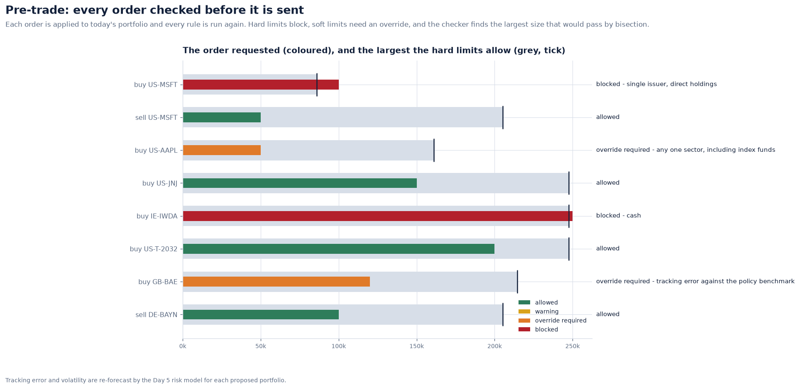
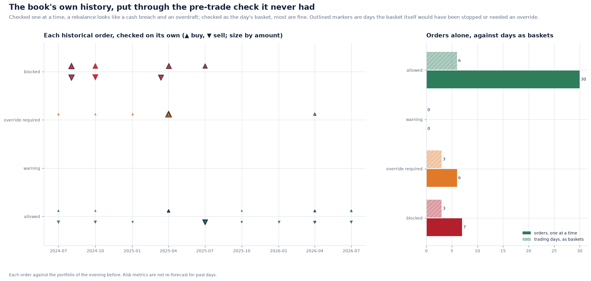
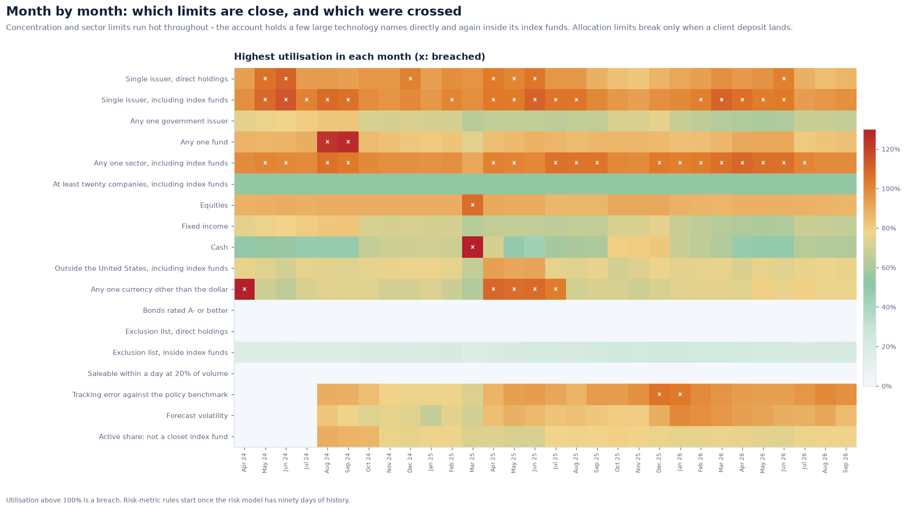
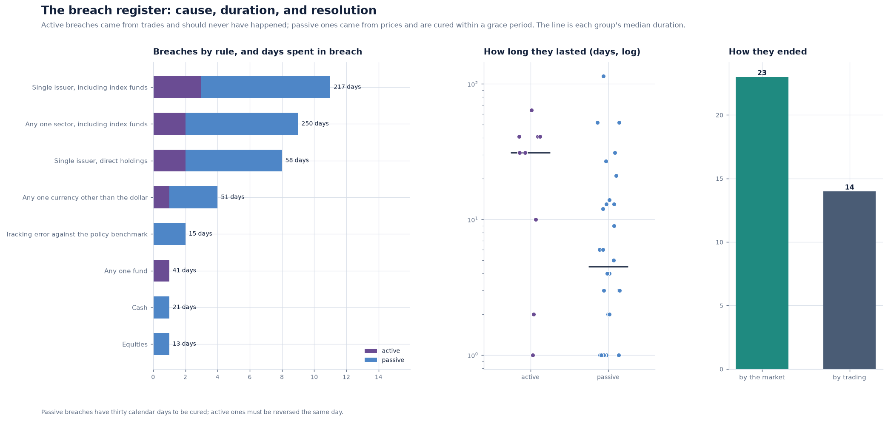
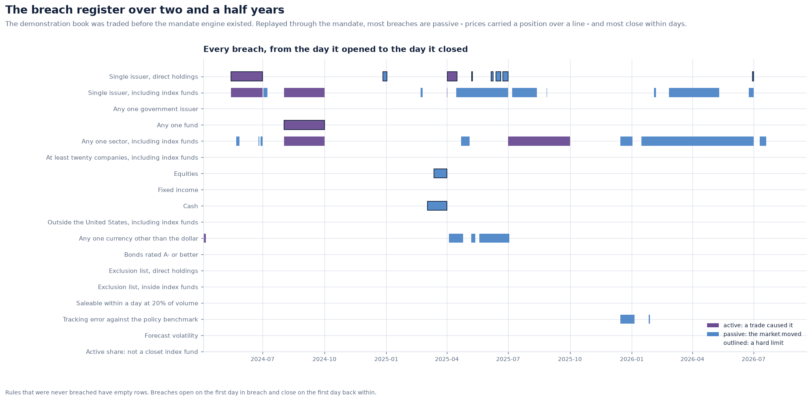
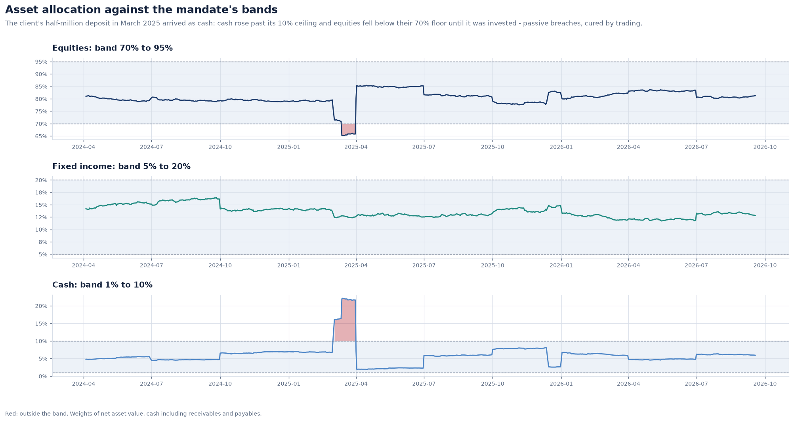
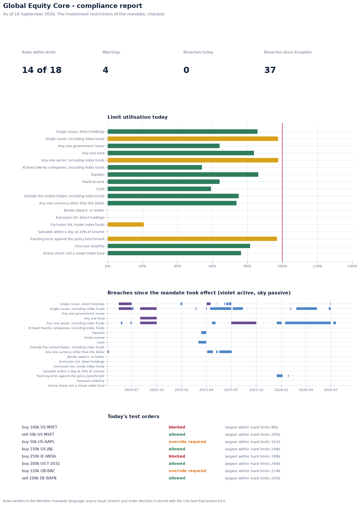

# Pre-trade and post-trade compliance, and the breach register

A mandate is checked twice:
- **before a trade**, to stop an order that would break it;
- **after the close**, to catch what the market did to a portfolio no one traded.

The two checks answer different questions, and the difference between an **active**
breach and a **passive** one is what a regulator asks about first.

**Implementation:** [`compliance/pretrade.py`](../../src/meridian/compliance/pretrade.py),
[`compliance/monitor.py`](../../src/meridian/compliance/monitor.py),
[`services/demo_compliance.py`](../../src/meridian/services/demo_compliance.py) ·
**Decisions:** [ADR 0029](../adr/0029-breaches-are-active-or-passive-and-age-against-a-deadline.md),
[ADR 0030](../adr/0030-pre-trade-checks-judge-the-portfolio-after-the-order-and-baskets-as-a-whole.md)

---

## 1. Pre-trade: the portfolio as it would be

An order is checked by applying it to today's snapshot (the security's weight goes up,
cash goes down by the same amount) and running every rule on the portfolio as it would
be. Each rule then reports one of these effects:

| Effect | Decision |
| --- | --- |
| a hard limit newly broken, or a hard breach made worse | **blocked** |
| a soft limit newly broken, or a soft breach made worse | **override required** |
| a warning level newly crossed | **warning** |
| an existing breach reduced | **allowed**: a trade towards compliance is never blocked |
| nothing that matters changes | **allowed** |

Risk-metric rules are re-forecast for the proposed portfolio with the Day 5 model. A
purchase of BAE Systems needs an override not because of any weight limit, but because
it would take the tracking error past 6%.

**The largest order that fits** is found by bisection on the order's size: forty
halvings find it to a fraction of a dollar. A $100,000 Microsoft purchase is blocked,
because it would take the direct holding from 10.29% to 12.28% against a 12% hard
limit. The largest Microsoft purchase the hard limits allow is **$85,976**.

## 2. Baskets

A rebalance is several orders at once: sell the fund, buy the stocks with the proceeds.
Checked one at a time, the sale looks like a cash breach and the purchases like an
overdraft. Checked together they are neither. `check_basket` applies all the orders and
judges the result, which is how program trades are checked in practice.

## 3. The book's own history, replayed

The Day 3 book was traded before this engine existed. Every one of its 43 buys and sells
was put through the pre-trade check, against the portfolio of the evening before:

| | Allowed | Override required | Blocked |
| --- | ---: | ---: | ---: |
| Orders one at a time | 30 | 6 | 7 |
| Trading days as baskets (12 days) | 6 | 3 | 3 |

Half the orders that look like problems one at a time are the halves of rebalances.
Checked as baskets, three trading days would still have been stopped:
- **2 August 2024:** a purchase of the S&P 500 fund that took it to 25% of the account;
- **13 March 2025:** a sale into an account already holding the client's new cash;
- **2 April 2025:** a Bayer purchase that broke the single-issuer limit.

## 4. Post-trade: every day, every rule

After each close the whole mandate is checked. Over the 618 days since the mandate
took effect, the account spent time in breach of eight of its eighteen rules. The limits
that run hot are the concentration limits: the account holds a few large technology
names directly and again inside its index funds.

## 5. Active and passive breaches

A breach **opens** on the first day a rule is broken and **closes** on the first day it
is not. It is:

- **active** if the portfolio caused it: something traded since the previous check is
  part of what broke the rule. For "max weight by", only the breaching group counts
  (a trade in Financials does not make a technology breach active). A trade in an index
  fund touches every constituent it contains.
- **passive** if the market caused it: prices carried a compliant portfolio over a line
  that no one crossed on purpose.

An active breach has to be reversed at once. A passive one may be cured within a grace
period of thirty calendar days here, in the spirit of UCITS article 57, which asks for
remedy "as a priority objective … taking due account of the interests of unitholders".
A breach past its deadline is **overdue**, and the compliance run refuses to store an
overdue hard breach quietly.

The register holds **37 breaches**:
- **9 active** (3 of hard limits) and **28 passive** (8 of hard limits);
- **23 were resolved by the market**, and **14 by trading**.

Passive breaches were mostly short: the median lasted 4.5 trading days, while the median
active breach lasted 31, about six weeks. An active breach is a position someone chose
and held; a passive one is often undone by the next day's prices.

## 6. A client deposit is a passive breach

On 3 March 2025 the client deposited half a million dollars. Cash rose to 16%, then 22%,
past its 10% ceiling, and equities fell below their 70% floor. Neither breach was
caused by a trade, so both are passive. Both were cured on 1 April 2025, when the cash
was invested. The pre-trade replay shows the other side of the same event: a sale on
13 March, into an account already over its cash limit, would have been blocked.

## 7. What is stored

`meridian compliance run --persist` stores:
- the rules, as text with their SHA-256 hash;
- every day's result for every rule (11,124 rows);
- the register;
- the pre-trade decisions.

Before it writes, three controls must pass:
- every stored text parses back to the rule that ran;
- every breach opened on a day its rule was in breach;
- no hard breach is overdue.

`meridian compliance stored` recounts the statuses and the days in breach in SQL, and
the tests hold them equal to the Python figures on SQLite and on PostgreSQL.

