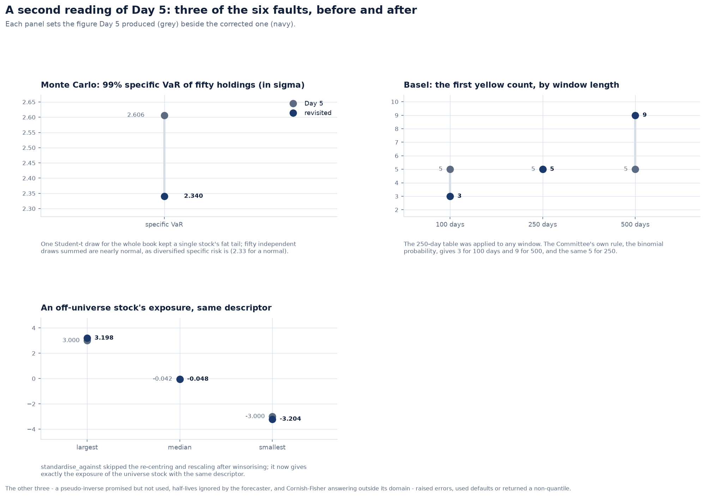
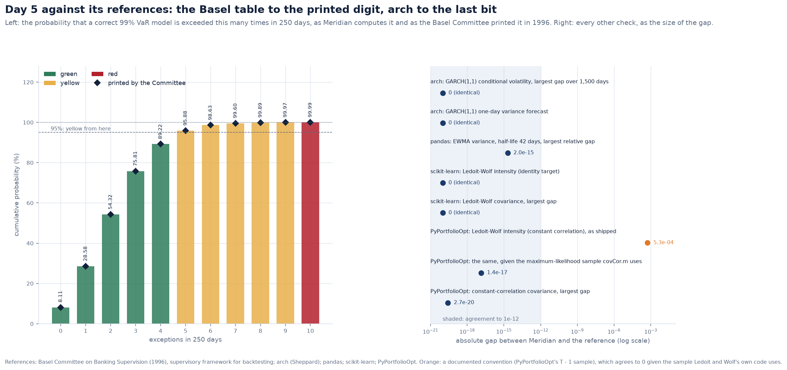
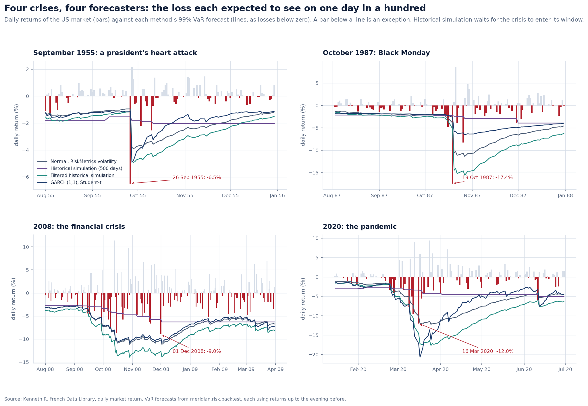
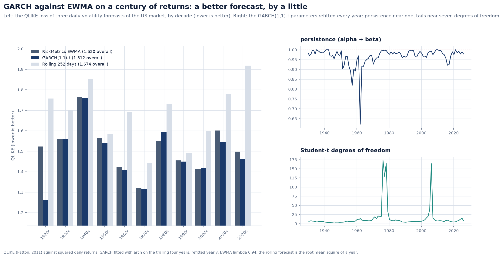
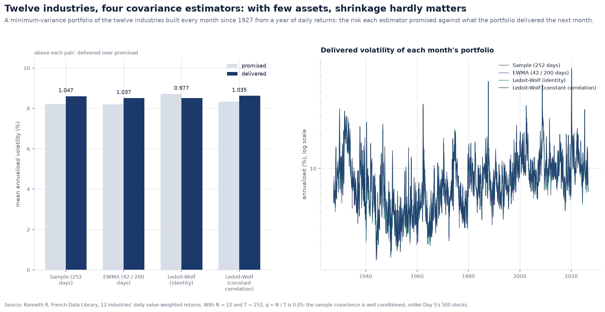

# Risk against the references, and on a century of daily returns

Day 5 built a factor risk model and validated it against a synthetic universe of 500
stocks whose true risk is known. That is the right way to measure a forecaster: the
truth is there to compare with. It has one blind spot: the universe contains only the
behaviour its author wrote into it. This revisit holds the module to:

1. **a second reading of the code**, which found six faults;
2. **independent references**: the Basel Committee's own table, `arch`, pandas,
   scikit-learn and PyPortfolioOpt;
3. **a century of daily US returns**: every trading day since 1 July 1926 from
   Kenneth French's data library, on which the classic market-risk forecasters are run
   and scored as a regulator would score them.

---

## 1. Six faults in a second reading

- **Monte Carlo VaR drew one Student-t for the whole book's specific risk.** The
  docstring promised one per asset. The difference matters because the sum of
  independent fat-tailed shocks is thinner-tailed than any one of them. For fifty
  equal holdings, the 99% specific VaR was 2.61 sigma, the tail of a single stock; it
  is 2.34 now, close to the normal 2.33 that diversified specific risk should have. On
  the demonstration account the Monte Carlo VaR fell from 1.99% to 1.92%.
- **The Basel traffic light was a 250-day lookup.** The Committee defines its zones by
  the cumulative binomial probability of the number of exceptions under a correct
  model: green below 95%, red from 99.99%. That rule reproduces the 1996 table exactly,
  and it gives the zones for any other window. For 100 days the first yellow count is
  3, not the table's 5; for 500 days it is 9.
- **`minimum_variance_weights` promised a pseudo-inverse for a singular matrix** and
  raised an error instead. It now falls back to the minimum-norm solution.
- **`RollingForecaster` ignored its own half-lives** in the model description and in
  the factor and specific z-scores, which used the defaults whatever it was given.
- **Cornish-Fisher answered outside its domain.** The expansion is a polynomial in the
  normal quantile. For large enough skewness it stops being increasing, so a more
  extreme probability maps to a smaller loss (Maillard, 2012). The function now checks
  monotonicity across the tail it uses and refuses to answer where it fails.
- **Exposures for assets outside the estimation universe skipped two steps.**
  `standardise` winsorises, then re-centres and rescales; `standardise_against`
  stopped after winsorising. A stock outside the universe therefore got a different
  exposure from a universe stock with the same descriptor. Both now apply one fitted
  `Standardisation`. On the account, the style contribution moved by three hundredths
  of a point and the volatility forecast from 12.22% to 12.24%.

## 2. Against the references

| Reference | What is compared | Gap |
|---|---|---|
| Basel Committee (1996), Table 2 | zone, plus factor and printed cumulative probability for 0-10 exceptions | none, to the printed digit |
| arch | `garch_filter` against `arch`'s conditional volatilities over 1,500 days, with its parameters and backcast | 0 |
| arch | the one-day variance forecast | 0 |
| pandas | the EWMA variance of `EwmaState` against `ewm(adjust=True)` | 2e-15 |
| scikit-learn | Ledoit-Wolf shrinkage towards the identity | 0 |
| PyPortfolioOpt | Ledoit-Wolf shrinkage towards constant correlation | 0, given the same sample (see below) |

**PyPortfolioOpt and the sample covariance.** Out of the box, PyPortfolioOpt's
constant-correlation intensity differs from Meridian's in the fourth decimal.
PyPortfolioOpt ports Ledoit and Wolf's own Matlab code, `covCor.m`, but feeds it the
unbiased sample covariance (divided by T - 1). The original divides by T. Given the
maximum-likelihood sample `covCor.m` uses, PyPortfolioOpt agrees with Meridian to the
last bit, so Meridian's is the faithful port. The difference is recorded as a
convention, not a break.

The GARCH recursion is now a single function, `garch_filter`. The reference check
exercises the same function every forecaster uses, not a copy written for the test.

## 3. A century of daily VaR

Four one-day 99% VaR forecasters run on the US market's daily return, every day from
November 1929 to August 2026 (25,317 days). Each uses only returns known the evening
before:

- **normal with RiskMetrics volatility**: an EWMA with lambda 0.94, the industry's
  reference point;
- **historical simulation**: the empirical 1% quantile of the last 500 days;
- **filtered historical simulation** (Barone-Adesi et al., 1999): the last 500 days
  divided by their own EWMA volatility, their quantile scaled by today's;
- **GARCH(1,1) with Student-t innovations**, refitted every year on the trailing four
  years with `arch`.

| Method | Exceptions (1% expected) | Kupiec p | Christoffersen p | Green / yellow / red years |
|---|---|---|---|---|
| Normal, RiskMetrics | 2.12% | 2e-54 | 2e-6 | 40 / 50 / 8 |
| Historical simulation | 1.43% | 1e-10 | 5e-19 | 65 / 23 / 10 |
| Filtered historical simulation | 1.17% | 0.007 | 3e-4 | 84 / 14 / 0 |
| GARCH(1,1)-t | 1.38% | 1e-8 | 4e-5 | 72 / 24 / 2 |

- **The normal tail is too thin.** The normal model is exceeded twice as often as it
  promises.
- **Historical simulation reacts late.** A crisis enters its window only after it
  happens, and then stays for 500 days. Its exceptions cluster most, and it has the most
  red years.
- **Filtered historical simulation is the only method with no red year in 97.** It
  combines the tails of history with the volatility of now.
- **None of the four passes Kupiec over a century.** Over 25,000 days the test has
  enough power to reject a model that is right to within a few tenths of a percent.

**The worst surprise was not 1987.** Measured against the RiskMetrics VaR forecast
made the evening before, the largest loss of the century was 26 September 1955, the
day after Eisenhower's heart attack: 6.5%, 6.8 times the forecast. Black Monday lost
17.4% but came in an already volatile October, at 4.5 times.

## 4. Is the forecast the right size?

Day 5 judged its forecasts with the bias statistic: the standard deviation of each
day's return over the forecast made the evening before, which is one for a correct
forecast. On real data, for the market and all twelve industries, decade by decade:

The RiskMetrics forecast is **too low in every one of the 143 cells**, by 3% to 27%.
Part of this is fat tails: the forecast is a variance, and the bias statistic punishes
the days the variance did not see coming. Part is arithmetic: dividing by a noisy
forecast raises the statistic even when the forecast is unbiased in variance, as
Jensen's inequality says it must. A real model review reads 1.05 on daily equity data
as normal, which is worth knowing before reading 1.05 as a failure.

## 5. GARCH against EWMA

On the QLIKE loss (Patton, 2011), which ranks variance forecasts correctly however
noisy the squared-return proxy:

| Forecast | QLIKE, whole century |
|---|---|
| GARCH(1,1)-t | 1.512 |
| RiskMetrics EWMA | 1.520 |
| Rolling 252 days | 1.674 |

GARCH wins in nine of eleven decades, by a little. Its yearly fits keep persistence near
one (median 0.978) and the Student-t near seven degrees of freedom. A rolling year is
clearly worst: it reacts slowly and forgets abruptly.

## 6. Covariance with twelve assets

A minimum-variance portfolio of the twelve industries is built every month from a year
of daily returns with four estimators. Their mean promised and delivered volatility
differ by under five percent: with N = 12 and T = 252 the sample covariance is well
conditioned (q = 0.05). Ledoit-Wolf towards the identity is the only estimator that
promised more risk than it delivered. Shrinkage is a remedy for dimension, which is
why Day 5's 500-stock universe needed it and twelve industries do not.

## 7. Data and limits

- The daily data are value-weighted industry and market returns from CRSP, through the
  Kenneth R. French Data Library, which publishes them for research and teaching and
  asks to be cited. They are packaged so every figure here is reproducible offline;
  `meridian.devtools.fetch_french` rebuilds them.
- The century backtests are on an index, not a portfolio with positions: there are no
  factor exposures to replay, so they test the forecasters, not the factor model.
- The GARCH model is refitted yearly to keep the backtest to seconds; a production
  system would refit monthly, as Day 5's own forecaster does.
