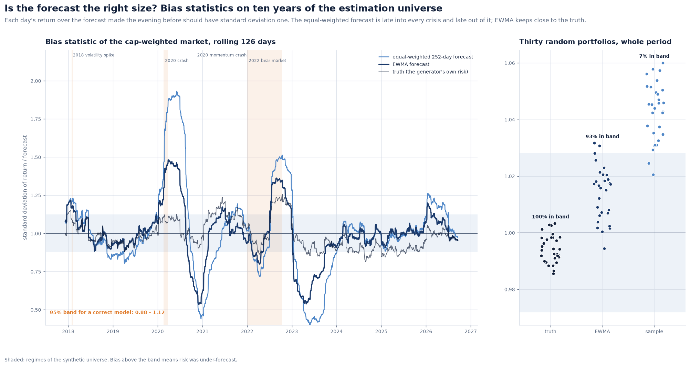
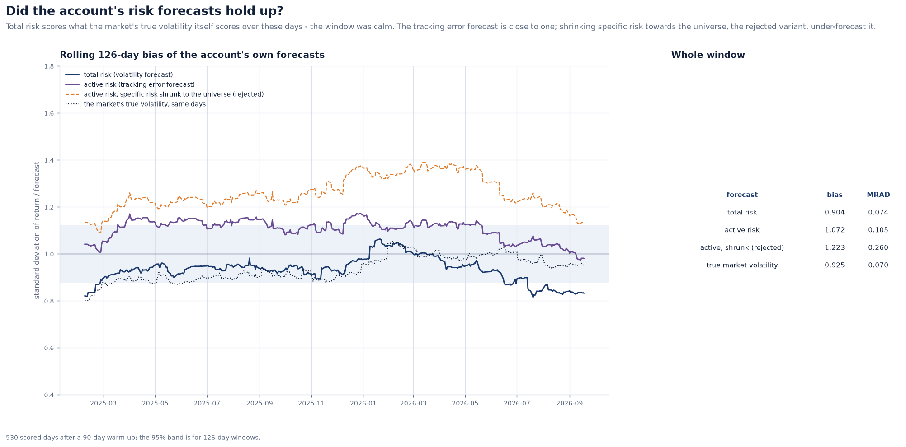
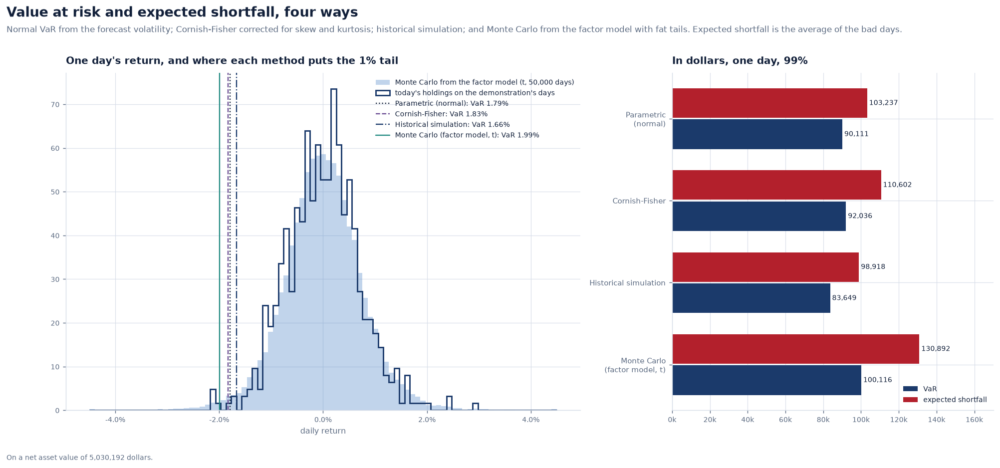
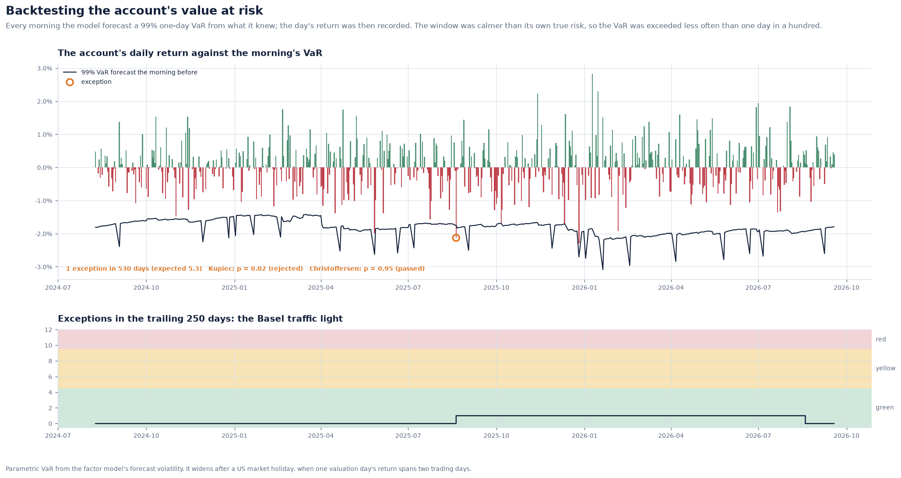
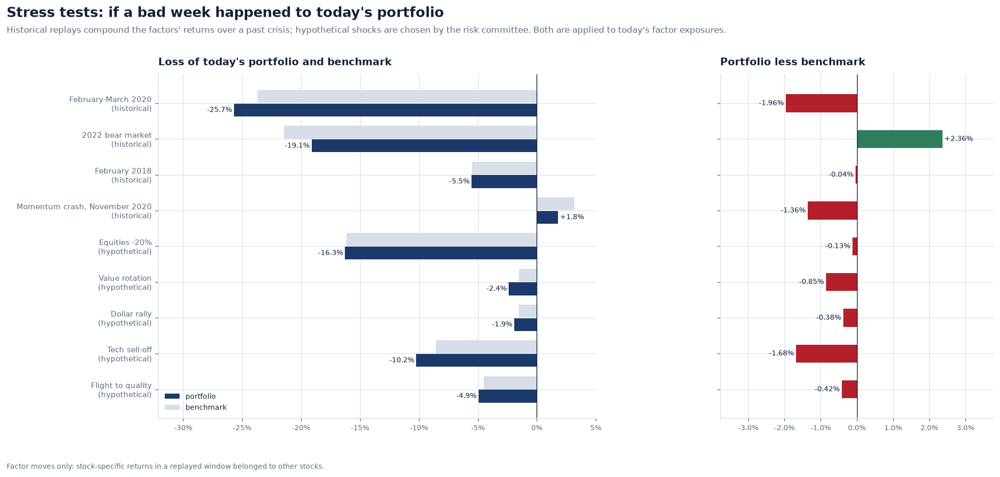
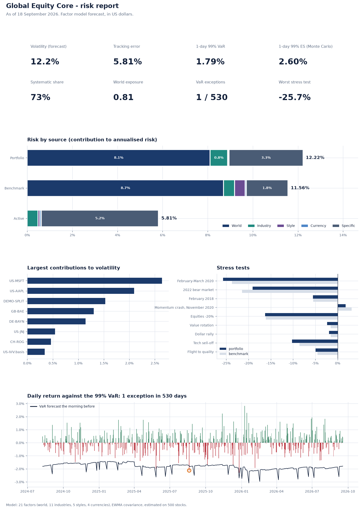

# Validating a risk model: bias statistics, VaR backtests and stress tests

A risk model is a forecast, and a forecast has to be validated. Most toy risk models
stop at producing a number. This note describes how Meridian's model is checked, and
what the checks found, including the three mis-specifications they caught.

**Implementation:** [`risk/validation.py`](../../src/meridian/risk/validation.py),
[`risk/forecast.py`](../../src/meridian/risk/forecast.py),
[`risk/var.py`](../../src/meridian/risk/var.py),
[`risk/stress.py`](../../src/meridian/risk/stress.py) ·
**Decision:** [ADR 0026](../adr/0026-a-risk-model-ships-with-its-validation.md)

---

## 1. The bias statistic

If a volatility forecast is right, each day's return divided by the forecast made the
evening before, the standardised outcome z, has standard deviation one. Over T days the
**bias statistic** is the standard deviation of the z's. For a correct model it lies
within `1 ± 1.96 / √(2T)` about 95% of the time:

- above the band, risk was **under**-forecast;
- below it, risk was **over**-forecast.

A rolling bias statistic shows *when* a model was wrong. The mean rolling absolute
deviation from one (**MRAD**) summarises how wrong on average.

Honesty about time is built in. `RollingForecaster` runs the model forward day by day:
each morning it may use factor and specific returns up to the previous close and that
morning's exposures, and nothing else.

## 2. Ten years on the estimation universe

The cap-weighted market and 30 random 40-stock portfolios were forecast every day for
2,417 days, by three forecasters:

| Forecaster | Market bias | Market MRAD | Random portfolios in band | Random MRAD |
| --- | ---: | ---: | ---: | ---: |
| Truth (the generator's own risk) | 0.992 | 0.081 | 100% | 0.080 |
| **EWMA** | **1.013** | **0.127** | **93%** | **0.119** |
| Equal-weighted 252 days | 1.052 | 0.204 | 7% | 0.188 |

The truth row is the floor any forecaster could reach: with 126-day windows, even the
true risk wanders from one by 0.08 on average. EWMA keeps close to it. The
equal-weighted window is late into every crisis (a bias of 1.9 in 2020) and late out of
it (0.4 in 2023, still forecasting a crisis that had ended).

Every individual factor's bias lies between 0.98 and 1.02.

## 3. The account's own forecasts

Every morning of the demonstration window after a 90-day warm-up (530 days), the model
forecast the account's volatility and tracking error from what it knew. The day's
return was then recorded against it.

| Forecast | Bias | 95% band | MRAD |
| --- | ---: | :---: | ---: |
| Total risk | 0.904 | 0.94 – 1.06 | 0.074 |
| Tracking error | 1.072 | 0.94 – 1.06 | 0.105 |
| *Yardstick: the market's true volatility, same days* | *0.913* | | *0.070* |

Total risk reads 0.90, just below the band. The yardstick shows why: a forecaster that
knew the Day 2 market's **true** conditional volatility every day scores 0.91 over the
same window. The window was calmer than its own true risk. The model scores what the
truth scores, and a bias test cannot ask more.

The tracking error forecast is close to one. Getting it there took three corrections,
each found by this backtest:

1. **Fund basis.** The two index funds deviate from their look-through constituents by
   about 12% a year. Without a basis term, the tracking error was under-forecast
   (bias 1.18). The basis is now its own specific-risk line.
2. **Beta.** The Day 2 stocks have market betas from 0.57 (Johnson & Johnson) to 1.20
   (Apple). The universe's beta factor was at first loosely tied to the world factor, so
   market sensitivity could not flow through it. The universe now moves each stock by
   its true beta times the world factor, as Barra's beta factor does.
3. **The specific-risk prior.** Shrinking the account's specific risks towards the
   universe's size deciles raised the tracking error bias to 1.22 (MRAD 0.26). The
   prior was wrong for these stocks, so shrinkage was rejected (see the covariance
   note).

## 4. Value at risk, four ways

On the last day, one-day 99% VaR and expected shortfall on a NAV of 5.03 million
dollars:

| Method | VaR | ES |
| --- | ---: | ---: |
| Parametric (normal) | 1.79% | 2.05% |
| Cornish-Fisher (skew and kurtosis) | 1.83% | 2.20% |
| Historical simulation (today's holdings) | 1.66% | 1.97% |
| Monte Carlo from the factor model, Student-t | 1.99% | 2.60% |

Expected shortfall is the measure Basel's Fundamental Review of the Trading Book
adopted, because it says how bad the bad days are and diversification never increases
it. The Monte Carlo draws factor returns from a *multivariate* Student-t, so in a crash
every factor is hit at once, which independent draws would miss. That is why its
shortfall is the largest.

## 5. Backtesting the VaR

A 99% VaR should be exceeded on about 1% of days, and the exceedances should not
cluster.

- **Kupiec's proportion-of-failures test:** is the number of exceptions consistent with
  1%? A likelihood ratio, χ² with one degree of freedom.
- **Christoffersen's independence test:** is an exception more likely the day after an
  exception? Clustering means the model reacts too slowly.
- **The Basel traffic light:** up to four exceptions of a 99% VaR in 250 days is green,
  five to nine yellow (with a rising capital multiplier), ten or more red.

Over 530 days there was **one** exception against 5.3 expected. Christoffersen passes
(p = 0.95) and the traffic light is green throughout. Kupiec rejects (p = 0.02), and it
rejects for too *few* exceptions. That is the same calm window the bias statistic saw:
parametric VaR from a correct volatility forecast is conservative when the realised
market is quieter than its own true risk. A test that can reject a model for being too
careful is doing its job.

## 6. Stress tests

VaR describes an ordinary bad day; a stress test asks about a specific extraordinary
one. The factor returns of past crises are compounded and applied to today's
exposures, alongside shocks chosen by a risk committee:

| Scenario | Portfolio | Benchmark | Active |
| --- | ---: | ---: | ---: |
| February–March 2020 (replay) | −25.7% | −23.7% | −2.0% |
| 2022 bear market (replay) | −19.1% | −21.5% | +2.4% |
| February 2018 (replay) | −5.5% | −5.5% | 0.0% |
| Momentum crash, November 2020 (replay) | +1.8% | +3.2% | −1.4% |
| Equities −20% | −16.3% | −16.1% | −0.1% |
| Tech sell-off | −10.2% | −8.5% | −1.7% |

The account would have lost two points more than its benchmark in the 2020 crash; its
health care overweight would have helped in 2022. Stock-specific returns are left out,
because the specific returns of a replayed window belonged to other stocks.

## 7. Controls before anything is stored

`meridian risk run --persist` checks three controls first, and writes nothing if any
fails:

- every decomposition adds up to its total, to 1e-10;
- every forecast is a finite, positive number;
- the VaR backtest over the last 250 days is not in the Basel red zone.

The stored forecasts can be recounted in SQL: the exception count and the factor
volatilities are recomputed from the database and held equal to the Python figures on
SQLite and PostgreSQL.

