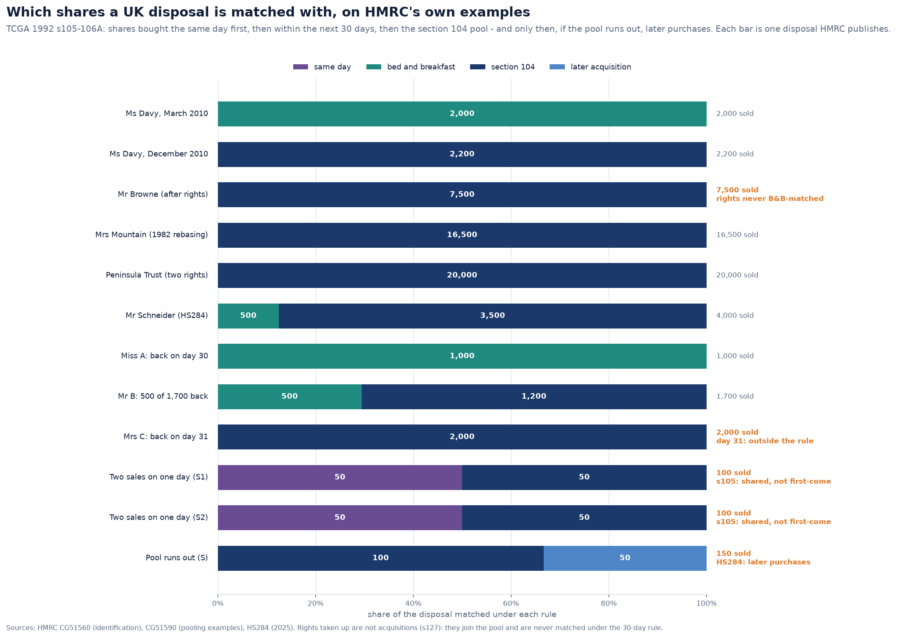
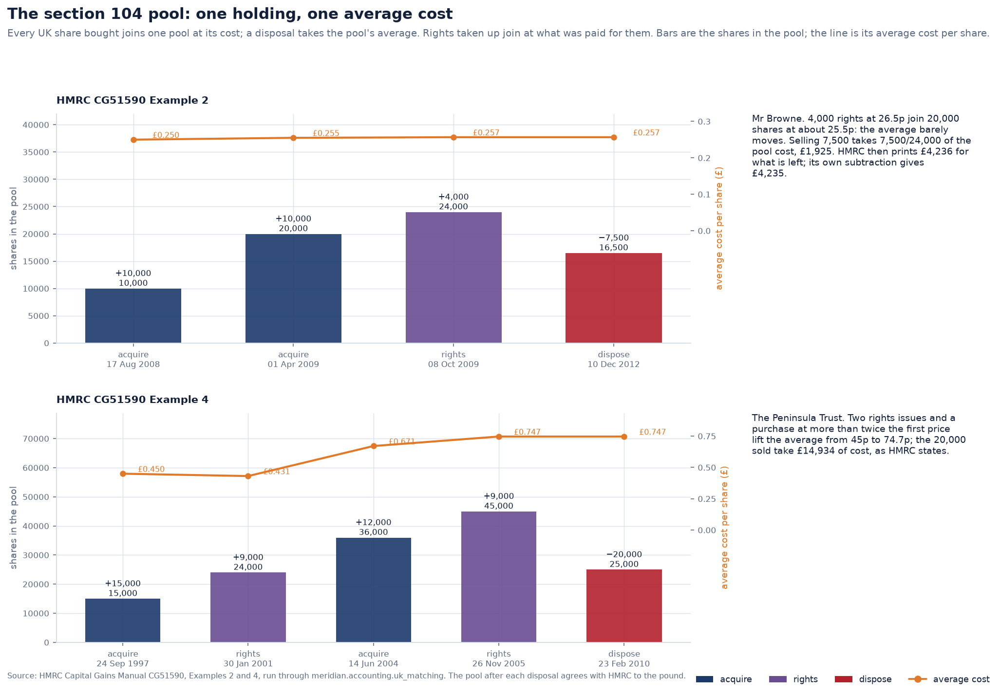
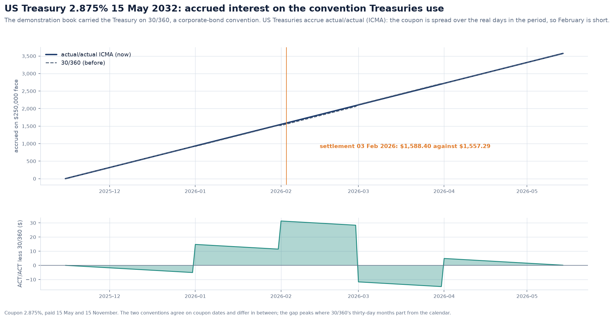

# The book of record against the tax authorities, and against its own invariants

Day 3 built the book of record: a double-entry ledger, tax lots, the US wash sale
rule, UK share identification, valuation, the value bridge and reconciliation. Its
tests were written from the rules, by the same hand as the code. That catches
mistakes in the code. It cannot catch mistakes in reading the rules, because the
same reading wrote both.

This revisit uses two checks that do not share the author's reading:

1. **The authorities' own worked examples.** The IRS and HMRC publish examples to
   explain their rules. They are run through the engine exactly as published, with
   the published dates and amounts, and every figure the authority states is set
   beside the one the engine computes.
2. **Properties that must hold for any input.** Hypothesis writes random trade
   histories, and the book is checked for what no history may break.

Between them they found three gaps in UK matching, two engine bugs and one
arithmetic slip in HMRC's own manual.

---

## 1. Forty-two published figures

| Authority | Source | What it exercises |
|---|---|---|
| IRS | Publication 550, *Wash Sales*, Example 1 | the disallowed loss joins the replacement basis |
| IRS | *More or less stock bought than sold*, Example 1 | replacements bought **before** the sale, a partial disallowance |
| IRS | *More or less stock bought than sold*, Example 2 | replacements matched in the order bought |
| IRS | *Loss and gain on same day* | a disallowed loss may not reduce gains on other blocks |
| HMRC | CG51590 Examples 1-4 | bed and breakfast, the pool, two rights issues, a 1982 rebasing |
| HMRC | HS284 Example 2 | 500 of 4,000 shares bought back within 30 days |
| HMRC | CG51560 Examples 1-3 | day 30 is inside the rule; day 31 is not |

The IRS figures agree to the cent. HMRC prints whole pounds and does not always
round the same way, so its figures are compared to the pound. All 42 agree.

**One HMRC figure is wrong.** In CG51590 Example 2 (Mr Browne):

- the pool holds 24,000 shares at a cost of £6,160;
- 7,500 are sold, taking 7,500 / 24,000 × 6,160 = **£1,925** exactly;
- HMRC then prints the cost left as **£4,236**. Its own subtraction gives £4,235.

There is no rounding to account for the pound. The engine is not adjusted to match:
the figure is recorded in `devtools.tax_reference.KNOWN_ERRATA` with the arithmetic,
and a test checks that the engine still says £4,235.

### Where each disallowed dollar goes

The window runs 30 days on either side of the sale, so it catches shares bought
*before* a loss as well as after. Only as many shares as were sold can be
replacements. They are taken earliest first, and each carries the loss and the
holding period of the share it replaces.

## 2. UK matching, brought in line with the statute

The HMRC examples passed. Writing them, though, exposed three cases the module did
not handle as the law does.

- **Everything disposed of on one day is one disposal** (TCGA 1992 s105(1)). Two
  sales on a day were matched one after the other, so the first took every share
  bought that day and the second took the pool. They are now merged and matched once,
  and the result is split back to each sale pro rata.
- **Rights taken up are not an acquisition** (s127). They are part of the holding they
  were offered on, so they join the pool at their cost and are never matched under
  the 30-day rule. A purchase carries its rights issue in its metadata;
  `builders.rights_take_up` builds one.
- **A disposal the pool cannot cover** is matched with later acquisitions, earliest
  first (HS284, section 2). It used to be refused.

## 3. Properties that must always hold

`tests/accounting/test_book_invariants.py` lets Hypothesis write the histories:

- purchases and sales of a US and a UK share;
- some sold at a loss and bought back inside the window;
- FIFO, LIFO and HIFO relief, with sterling moving between trades.

For every history it checks:

- the trial balance is zero;
- the investment sub-ledger in the general ledger equals the open lots at
  historical cost, instrument by instrument, to the last decimal;
- the quantity held is what was bought less what was sold;
- every dollar of loss disallowed is carried in the basis of a replacement lot,
  open or since sold;
- no replacement share carries more than one sold share's loss;
- no lot's holding period starts after it was opened.

It found two bugs within seconds.

- **Shares sold together replaced each other.** A sale's lots gave up their
  replacement capacity one at a time. Under HIFO the loss on the first lot closed
  could therefore be matched to shares of a lot the *same* sale closed next. The
  disallowed loss landed on no open lot and vanished from the tax basis. Every lot a
  sale closes now gives up its capacity before any loss is matched.
- **An intraday round trip was refused.** Sales are booked before purchases on a
  day, so the day's proceeds are there for its purchases. A sale of shares bought
  that same morning therefore found nothing held. A sale of more than the day's
  opening holding is now booked after the day's purchases.

Each bug also has a plain regression test that fails without the fix.

## 4. The demonstration Treasury accrues actual/actual

The Day 1 revisit noted that the demonstration Treasury carried a 30/360 day count.
That is a corporate and agency convention. US Treasuries accrue **actual/actual
(ICMA)**: the coupon is spread over the actual days of the period. The bond now says
so.

On the purchase the tests use, settling 3 February 2026 on $250,000 face, accrued
interest is **$1,588.40** (80 of the 181 days) rather than $1,557.29 (78 of 180).
Across the whole suite the change moved one figure the tests state: the largest
Microsoft purchase the Day 6 hard limits allow, from $85,978 back to $85,976. That is
the figure it had before the Day 1 revisit moved it, and the documents that quote it
were updated with it.

## 5. What this does not cover

- The examples test the rules the authorities chose to illustrate. Rules they do
  not illustrate, such as wash sales across accounts and spouses or the UK
  bed-and-ISA position, are not covered.
- 1982 rebasing is entered as a cost in the Mountain example. The engine does not
  compute it, because no current portfolio holds shares from before April 1982.
