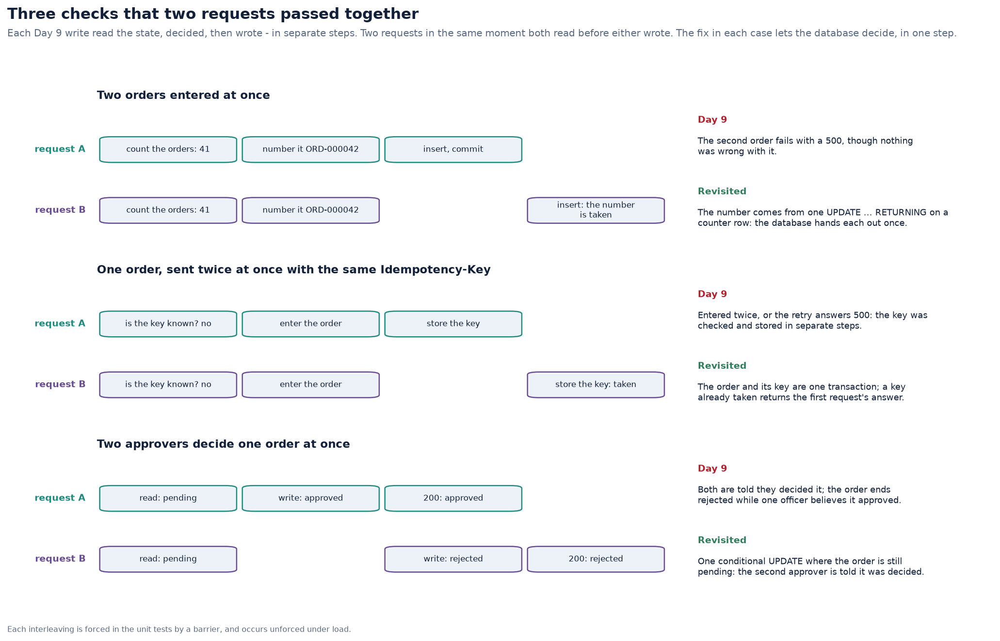
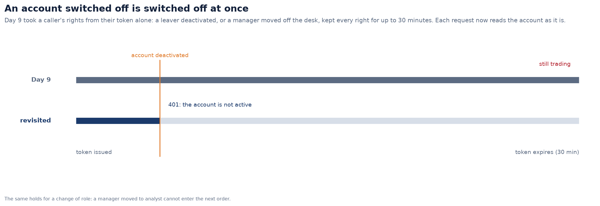
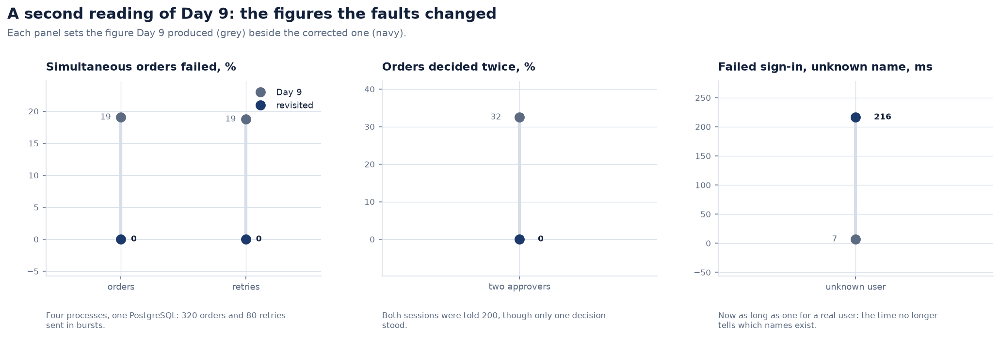

# The platform under concurrent requests and an attacker's questions

Day 9 built the web platform:

- a FastAPI service over the same objects as the command line;
- JWT authentication, roles and entitlements;
- idempotent writes and four-eyes approval of large orders;
- a hash-chained audit log;
- PostgreSQL, Docker and monitoring.

Its tests sent one request at a time to one process. That checks what the platform
does. It does not check what happens when two requests arrive together. A deployment
runs several workers, as the container does, and often several containers. Requests do
arrive together: a client retries after a timeout, two officers open the same order.

This revisit asks two questions Day 9's tests could not:

1. **What happens when requests arrive at the same moment?** Each race is forced in a
   unit test, and the platform is then run as it is deployed: four processes, one
   PostgreSQL, everything at once.
2. **What can an attacker, or an auditor, learn from the edges?** That means the time a
   failed sign-in takes, and what an account keeps after it is switched off.

They found five faults. Four came from the same pattern: a check followed by a write,
in separate steps.

---

## 1. Three checks that two requests passed together

Each of these Day 9 writes read the state, decided what to do, and wrote in a separate
step. Two requests in the same moment both read before either wrote:

| Write | Day 9 | What two requests at once did |
|---|---|---|
| a new order's number | the count of orders, plus one | both took the same number; the second failed with a 500 |
| a retried order (`Idempotency-Key`) | look the key up; enter the order; store the key | entered twice, or the retry failed with a 500 |
| a four-eyes decision | read the order as pending; write the decision | both approvers were told they had decided; the last write stood |

The last case is the most serious. One compliance officer approved an order, another
rejected it, and both were told 200. The order ended "rejected" while the first officer
believed it approved.

Left to the scheduler, such races are rare in a test, and a test of them is flaky. So
the unit tests (`tests/api/test_concurrency.py`) force them. A barrier holds each request
at the read until the other has read too, which is exactly the interleaving that breaks
a check-then-act. All three tests failed against the Day 9 code, every time.

**The fix in each case lets the database decide, in one step:**

- **Order numbers** come from a counter row. One `UPDATE ... RETURNING` runs inside the
  order's own transaction (migration 0011). The database hands out each number once, and
  an order rolled back gives its number back.

  The first fix tried here, retrying a taken number, held under the barrier but not
  under load. Forty orders at once all read the same count and one won each round, and
  on PostgreSQL every conflicting insert waits for the other to commit. The retries
  queued past a minute. The load test found that.
- **The order and its idempotency record are one transaction.** If the key is already
  taken, the same request got there first, and its stored answer is returned.
- **A decision is one conditional update**:
  `UPDATE ... WHERE order_id = ? AND status = 'pending approval'`. If no row changes,
  someone else decided first, and the answer is 409.

## 2. Four processes, one database, everything at once

The unit tests prove each interleaving is handled. Whether the platform keeps its
promises when deployed is a separate question. A lock inside one process (the audit
chain's `CHAIN_LOCK`) protects nothing across processes; only what the database
enforces does.

`tests/api/test_workers_postgres.py` sets up the deployment:

- four API processes on a fresh PostgreSQL database;
- requests spread over them in turn, as a load balancer would;
- many requests at the same moment, with nothing forced.

Measured over eight rounds, each of:

- 40 orders at once;
- one key sent 10 times at once;
- 5 large orders, each decided by two sessions at once.

| Promise | Day 9 | Revisited |
|---|---|---|
| every order entered is accepted | 61 of 320 failed with a 500 (19%) | all accepted |
| a retried order answers like the first | 15 of 80 retries failed with a 500 | all answered alike |
| one approver decides each order | 13 of 40 decided "twice" (32%) | one decision each |
| the audit chain is unbroken | intact | intact |

The audit chain held in Day 9 too. Its design was already right: a collision on the
sequence number is retried against the new head, so the chain never forks.

The measurements, and how they were taken, are kept in `docs/data/platform-under-load.json`.

**A note on running it on Windows.** Uvicorn's `--workers` mode shares one listening
socket among its workers. On Windows a worker can block in `accept()` while holding
connections it has not served, and requests time out. Thread dumps taken during the
hang showed the platform's own threads idle and one worker's event loop in a blocking
`accept`. The test therefore runs four separate single-process servers, as four
containers would be. It tests the same thing, the database as the only arbiter, without
that artefact. A virtual environment's `python.exe` on Windows is a launcher, so the test
stops each server's whole process tree.

## 3. What a failed sign-in told an attacker

A failed sign-in answers "incorrect username or password" whatever the cause, so as not
to reveal which usernames exist. But Day 9 hashed the password only for an account that
existed and was active. At the production work factor (PBKDF2-SHA256, 600,000
iterations), 15 tries each:

| Failed sign-in | Day 9 | Revisited |
|---|---|---|
| a real user, wrong password | 206 ms | 217 ms |
| a name that does not exist | **7 ms** | 216 ms |
| a deactivated account | **7 ms** | 218 ms |

The message was the same, but the time differed thirty-fold, which is enough to tell
real usernames from invented ones with one request each. OWASP's authentication guidance
names exactly this: responses must not allow user enumeration, by content or by timing.

Every sign-in now computes exactly one hash. That is against the account's stored hash,
or, where there is no account, against a decoy hash no password matches. A test counts
the hashes each kind of failure computes.

## 4. An account switched off is switched off at once

Day 9 read the caller's roles and portfolios from the access token alone, and a token
lives thirty minutes. Until the token expired:

- **a leaver whose account was deactivated** kept every right;
- **a removed account** kept every right;
- **a portfolio manager moved to analyst** could still enter orders.

The token now says only who is calling. Each request reads the account: missing or
inactive is refused with 401, and the roles and portfolios are the ones on record now.
The cost is one primary-key read per request.

## 5. What is still not here

- **A shared rate limit.** The token bucket is per process. Across four processes a
  user gets four times the limit. Redis would hold it in one place.
- **External anchoring of the audit chain.** The chain detects any edit inside the
  database. Detecting a rewrite of the whole table needs the head hash published
  elsewhere.
- **Session listing and revocation one by one.** Switching an account off revokes all
  of its sessions at once; ending one session alone would need a session store.

## References

- OWASP, *Authentication Cheat Sheet* — "Authentication and Error Messages" and timing-based user enumeration.
- OWASP, *Password Storage Cheat Sheet* (2023) — PBKDF2-HMAC-SHA256 at 600,000 iterations.
- IETF RFC 7519, *JSON Web Token*; RFC 8725, *JWT Best Current Practices*.
- PostgreSQL documentation, *Concurrency Control* — row locks, `UPDATE ... RETURNING`, and how a conditional update re-checks its condition after waiting.
- IETF draft, *The Idempotency-Key HTTP Header Field* (httpapi working group).
- Kleppmann, M. (2017), *Designing Data-Intensive Applications*, ch. 7 — lost updates and check-then-act races.
