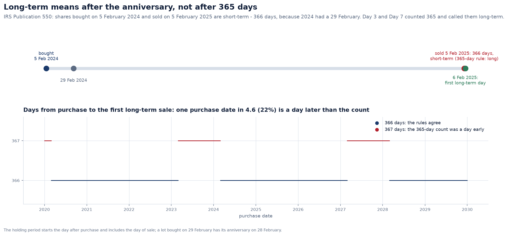
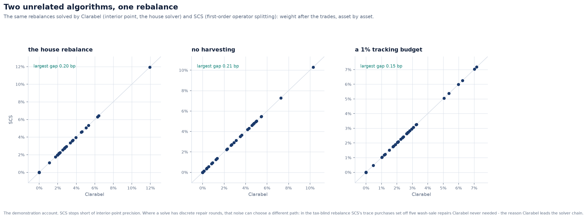
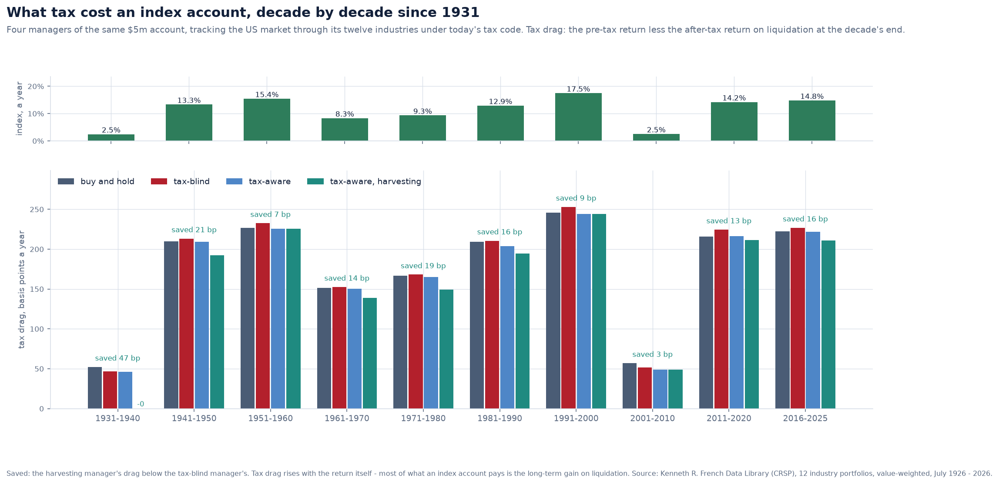
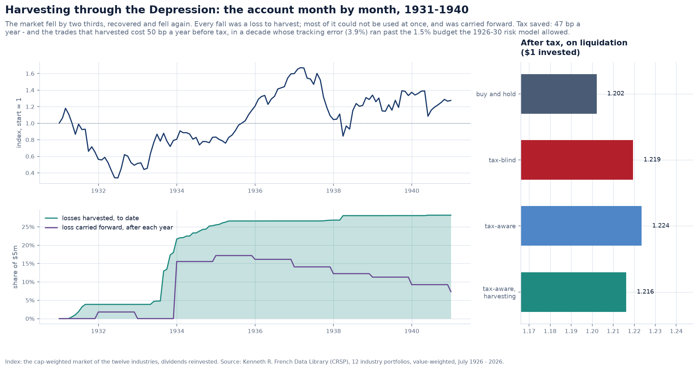

# The tax code as the IRS writes it, and harvesting on a century of real returns

Day 7 built a tax-aware rebalancer: a convex program that trades tracking error against
tax lot by lot, harvests losses, and respects the wash-sale rule and the mandate. A
backtest on simulated markets measured its tax alpha. Its tests were written from the
rules, by the same hand as the code, and that cannot catch a misreading of the rules.

This revisit uses three checks that do not share that reading:

1. **The IRS's own words and examples.** Publication 550's holding-period and
   carryover rules are run as published.
2. **A second implementation.** Day 3's book of record keeps the same yearly tax
   ledger, written separately. A property test now holds the two to the same tax and
   the same carryovers on random histories.
3. **A second algorithm, and real history.** The rebalance is solved again by an
   unrelated solver, and the managers run through a century of the US market rather
   than a model of it.

Together they found four faults: one in Day 3 as well as Day 7, three in Day 7 alone.

---

## 1. A year is not 365 days

A gain is long-term if the asset was held for **more than one year**. Day 3 and Day 7
both read that as more than 365 days. Publication 550 counts by the calendar instead:

- the holding period starts the day after the acquisition;
- it includes the day of the sale.

Its example is the leap-year case: shares bought on **5 February 2024** and sold on
**5 February 2025** are short-term. That is 366 days, because 2024 had a 29 February,
and a 365-day count calls it long-term. From 6 February the sale is long-term.

Over 2020 to 2029, **22% of purchase dates** reach long-term a day later than the count
said. That is every purchase whose following year spans a 29 February. The fault sat
in three places:

- the book's `TaxLot`;
- the realised lot's term;
- the optimiser's `LotState`.

All three now call one rule, `domain.positions.long_term_from`: the day after the
one-year anniversary. A lot bought on 29 February has its anniversary on 28 February.

On a sale one day from long-term, the difference is between 40.8% and 23.8% of the
gain. The optimiser prices exactly that difference when it chooses which lot to sell.

## 2. The carryover, as Schedule D computes it

Day 7's `TaxAccount` and Day 3's `TaxYearSummary` keep the same ledger:

1. net short-term against short-term, and long-term against long-term;
2. net the two against each other;
3. deduct up to $3,000 of a net loss from ordinary income;
4. carry the rest forward.

Hypothesis wrote random four-year histories and compared the two. They disagreed
three ways, and in each Day 3 was right:

| Fault in Day 7 | The rule | Example |
|---|---|---|
| the $3,000 came out of long-term losses as readily as short-term | Publication 550: "use your short-term capital losses first" | $2,000 short and $5,000 long lost: Day 7 carried $2,000 + $2,000, the IRS $0 + $4,000 |
| the deduction saved 37% + 3.8% | the 3.8% net investment income tax is charged on a positive net only | $3,000 saves $1,110, not $1,224 |
| a long-term loss larger than a short-term gain carried as short-term | after netting, the remainder keeps the character of the larger side | +$1,000 short, −$9,000 long: $5,000 carried as long-term, not short-term |

A short-term carryover offsets gains taxed at 40.8%, a long-term one gains taxed at
23.8%. Both faults in the character overstated harvesting in later years. The property
test now passes on every history tried: the tax each year and both carryovers agree.

## 3. A lot is not its own replacement

The wash-sale rule disallows a loss if substantially identical stock is acquired within
30 days before or after the sale. Day 7 asked only whether *any* lot of the security had
been bought in the last 30 days. So a lot bought last week and sold today at a loss was
always a wash sale, with the lot replacing itself.

The shares being sold are not a replacement. `has_replacement(lot, recent)` now asks
whether *another* lot was bought in the window, and a disallowed loss joins the basis of
another lot, never of the lot sold.

## 4. Two algorithms, one rebalance

Every rebalance test used the solver that produced the answer. The test market's
rebalances are now solved twice:

- by **Clarabel**, an interior-point method and the house solver;
- by **SCS**, first-order operator splitting, which shares no code with it.

They agree within half a basis point of NAV in every weight. On the demo account the
largest gap is 0.2 bp.

Clarabel sometimes reports `optimal_inaccurate`, which the solver chain accepts. That
was measured, not assumed. Over two decades of the century backtest it happened in 7 of
973 solves, and each matched a re-solve at 1e-10 tolerances to within 1e-8 of the
objective.

**SCS's imprecision can matter.** A rebalance is a sequence of convex solves with
discrete repairs between them: a wash-sale conflict forbids a purchase and solves again,
and an active-share floor is approached by convex-concave rounds. In the demo's
tax-blind rebalance, SCS's trace purchases of stocks whose loss lots were being sold set
off five wash-sale repairs that Clarabel never needed. The weights then differed by up
to 2.3%. This is why Clarabel leads the chain and SCS is the last resort.

## 5. Tax drag, measured honestly

Day 7 defined tax alpha as the after-tax return over the tax-blind manager's. That mixes
two things:

- the tax a manager avoided;
- what its trades did to the pre-tax return, which is tracking luck.

Its pre-tax return added the tax paid back to the final value. That leaves out what the
tax would have earned had it stayed in the account, so a manager that paid tax early
looked better before tax than it was.

The pre-tax return is now **time-weighted**, with tax an outflow, like a withdrawal.
Two measures follow:

- **tax drag**: the pre-tax return less the after-tax return on liquidation;
- **tax saved**: the drag below the tax-blind manager's, which is after-tax active
  return less pre-tax active return.

The identity *after-tax difference = pre-tax difference + tax saved* is a test.

Day 7's simulated backtest (16 paths of 36 months), recomputed with every fix:

| Manager | Pre-tax | After tax | Tax alpha (liquidated) | Tax saved | Tracking error | Turnover a year | Day 7 printed (after tax, alpha) |
| --- | --- | --- | --- | --- | --- | --- | --- |
| buy and hold | 6.17% | 4.69% | +0.22% | +0.35% | 0.83% | 0% | 4.69%, +0.14% |
| tax-blind | 6.29% | 4.47% | — | — | 0.08% | 91% | 4.55%, — |
| tax-aware | 6.26% | 5.02% | +0.55% | +0.58% | 0.58% | 44% | 5.10%, +0.54% |
| tax-aware, harvesting | 6.11% | 5.01% | +0.54% | +0.73% | 1.21% | 161% | 5.04%, +0.48% |

- **The tax-blind manager's pre-tax return rises from 6.15% to 6.29%** once tax is an
  outflow. It pays the most tax earliest, and the old measure charged it for the growth
  that tax would have earned.
- **Harvesting saves the most tax, 0.73% a year against 0.58% for tax-aware without
  harvesting.** On after-tax return the two are level (5.01% and 5.02%), because
  harvesting's turnover and tracking error cost it 0.15% before tax. Day 7 read the same
  tie as "harvesting pays for itself, just". The decomposition shows a real saving,
  spent on tracking.
- The fixes to the ledger move after-tax returns by up to 8 bp a year. The carryover
  order matters most where losses are carried for years, which three-year paths rarely
  do.

## 6. A century of real returns

`services.century_tax_alpha` runs the four managers through each decade since 1931 on
Kenneth French's twelve US industry portfolios, as an investor holds sector funds:

- **Prices** are each industry's cumulative value-weighted return.
- **The index** is the market's own weighting. Each month end the target is each
  industry's share of the market's value then: drift, plus the firms that listed, merged
  and failed. That reconstitution is what forces an indexer to trade.
- **The risk model** is the covariance over the 60 months before the decade (54 for the
  1930s). It is known on the first day and held fixed.
- **The tax code** is today's, and the client realises short-term gains elsewhere worth
  2% of the account a year.

`Market.from_history` builds the market. A test checks that the index rebuilt from the
twelve industries is the market return French publishes, to 1e-12.

| Decade | Index a year | Tax drag, tax-blind | Tax drag, harvesting | Tax saved | Pre-tax difference | Losses harvested |
|---|---|---|---|---|---|---|
| 1931-1940 | 2.5% | 47 bp | 0 bp | **+47 bp** | -50 bp | 28.2% |
| 1941-1950 | 13.3% | 213 bp | 192 bp | **+21 bp** | +41 bp | 7.2% |
| 1951-1960 | 15.4% | 233 bp | 226 bp | **+7 bp** | -24 bp | 0.1% |
| 1961-1970 | 8.3% | 153 bp | 139 bp | **+14 bp** | -19 bp | 4.8% |
| 1971-1980 | 9.3% | 168 bp | 149 bp | **+19 bp** | +16 bp | 6.9% |
| 1981-1990 | 12.9% | 211 bp | 195 bp | **+16 bp** | +86 bp | 7.7% |
| 1991-2000 | 17.5% | 253 bp | 244 bp | **+9 bp** | -5 bp | 2.0% |
| 2001-2010 | 2.5% | 52 bp | 49 bp | **+3 bp** | +37 bp | 8.7% |
| 2011-2020 | 14.2% | 224 bp | 211 bp | **+13 bp** | +1 bp | 2.7% |
| 2016-2025 | 14.8% | 227 bp | 211 bp | **+16 bp** | -52 bp | 2.9% |

What the century shows:

- **Harvesting had the least tax drag in every decade.** It saved 3 to 47 bp a year,
  and 15 bp at the median.
- **It was worth most when the market fell.** In the 1930s it harvested 28% of the
  account and saved 47 bp a year. In the 1950s, a decade of steady gains, it found
  almost nothing to harvest.
- **The 2000s are the exception.** The account harvested 9% in two crashes but saved
  only 3 bp a year. Its trades also realised gains of 7.9% of the account, against 3.6%
  for the tax-blind manager, and in a decade returning 2.5% a year there was little
  gain left to defer.
- **Tracking luck is as large as the saving.** In the 1930s the harvesting trades cost
  50 bp a year before tax, more than the 47 bp they saved, because the 1926-30 risk
  model expected 1.5% tracking error and the decade delivered 3.9%. In the 1980s the luck
  ran the other way, +86 bp. A manager judged on one decade's after-tax return is judged
  mostly on luck. The decomposition is what makes the comparison fair.

## 7. What is simplified

- **Twelve industries are not thousands of stocks.** Single stocks are far more
  dispersed, so a direct-indexing account finds many more losses. The century shows
  *when* harvesting pays, not how much a stock-level account adds.
- **Dividends are reinvested untaxed**, the same for every manager. That overstates the
  gains standing in every account.
- **Today's tax code applies throughout.** Rates in 1931 or 1981 were different; the
  question is how today's rules would have fared through those markets.
- **The risk model is fixed for each decade.** A manager would re-estimate it. The
  1930s show what an estimate from calmer years costs.

## References

- Internal Revenue Service, *Publication 550: Investment Income and Expenses* — the holding period, the capital loss limit and carryover, wash sales.
- Internal Revenue Service, *Instructions for Schedule D (Form 1040)* — the capital loss carryover worksheet.
- Internal Revenue Code §1091 (wash sales), §1211–1212 (capital losses), §1222 (holding period), §1411 (net investment income tax).
- French, K. R., *Data Library*: 12 industry portfolios, value-weighted (CRSP).
- O'Donoghue, B., Chu, E., Parikh, N. and Boyd, S. (2016), "Conic optimization via operator splitting and homogeneous self-dual embedding", *Journal of Optimization Theory and Applications* (SCS).
- Goulart, P. and Chen, Y. (2024), "Clarabel: an interior-point solver for conic programs with quadratic objectives".
- Chaudhuri, S., Burnham, T. and Lo, A. (2020), "An empirical evaluation of tax-loss-harvesting alpha", *Financial Analysts Journal*.
